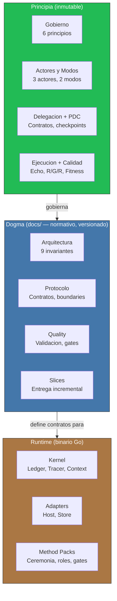

<!-- Virgil Principia
section_id: "2"
title: "Como es (estructura)"
source: "principia/overview.md"
source_lines: [194, 234]
layer: structure
constitutional: true
actors: []
glossary_terms: [Principia, Dogma, Runtime, Kernel, Method Pack, Ledger, Tracer]
depends_on: []
referenced_by: []
keywords:
  - estructura
  - tres capas concentricas
  - Principia
  - Dogma
  - Runtime
  - arquitectura
editorial_additions: [context_paragraph]
-->

> **Context:** Esta seccion describe la arquitectura de tres capas concentricas de Virgil — Principia, Dogma y Runtime — donde cada capa interna gobierna a las externas.

## 2. Como es (estructura)

[↑ Volver al indice](../README.md)

Tres capas concentricas. Cada capa interna gobierna a las externas.

Con esta estructura inmutable como cimiento, Virgil se manifiesta a través de ciclos de vida predecibles: una máquina de estados que rige proyectos y un flujo de invocación que garantiza trazabilidad en cada transición.
