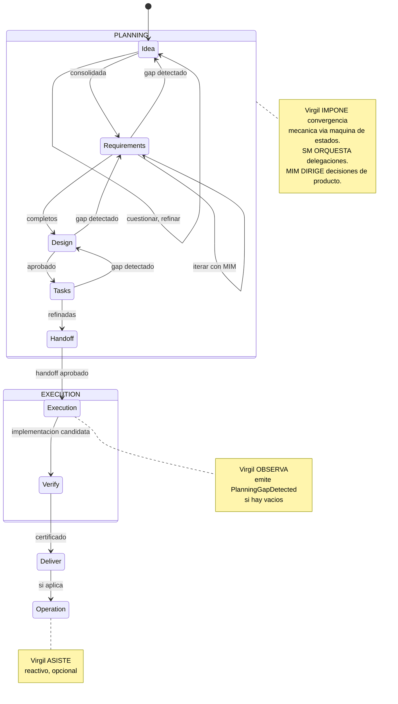

<!-- Virgil Principia
section_id: "3a"
title: "Ciclo de vida de un proyecto"
source: "principia/overview.md"
source_lines: [237, 290]
layer: lifecycle
constitutional: false
actors: [MIM, SM]
glossary_terms: [FastForward, PlanningGapDetected]
depends_on: []
referenced_by: [7c, 11a]
keywords:
  - ciclo de vida
  - state machine
  - maquina de estados
  - PlanningGapDetected
  - FastForward
  - planning
  - execution
  - handoff
-->

> **Context:** MIM (humano que dirige decisiones de producto) y SM (agente orquestador que delega el trabajo) son los actores que operan esta maquina de estados. El ciclo de vida es configurable por Method Pack — el Kernel impone la convergencia mecanica, pero la ceremonia especifica de cada fase puede variar segun el Pack activo.

## 3. Como actua

[↑ Volver al indice](../README.md)

### 3a. Ciclo de vida de un proyecto

Cada fase itera hasta consolidar su deliverable. No es una linea recta —
es un loop que converge hacia un handoff bien acotado.

La maquina de estados del proyecto (via virgil_status) indica en que
fase esta cada feature y el proyecto en general. Un feature no avanza
hasta que su deliverable esta consolidado.

**PlanningGapDetected**: si execution descubre que un deliverable aprobado
es ambiguo, contradictorio o insuficiente, emite esta senal, bloquea
solo el scope afectado y devuelve el control a planning. Execution
nunca reescribe un deliverable aprobado.

**FastForward**: el SM no siempre ejecuta todas las fases con la misma
ceremonia. Evalua un gradiente de certeza (FF-1 a FF-4) sobre el contexto
existente y comprime las fases proporcionalmente — desde ceremonia
completa (score 0-2) hasta ejecucion directa (score 6-8). El SM computa el score sobre estado observable y verificable. La formula de scoring y los inputs + resultado se registran en el Ledger, haciendolo auditable. FastForward comprime CEREMONIA de planning (fases de deliberacion), no gates de calidad del Kernel — los gates de certificacion (R/G/R, mutation testing, fitness functions) se ejecutan integros en TODOS los niveles de FastForward, desde FF-1 hasta FF-4.
