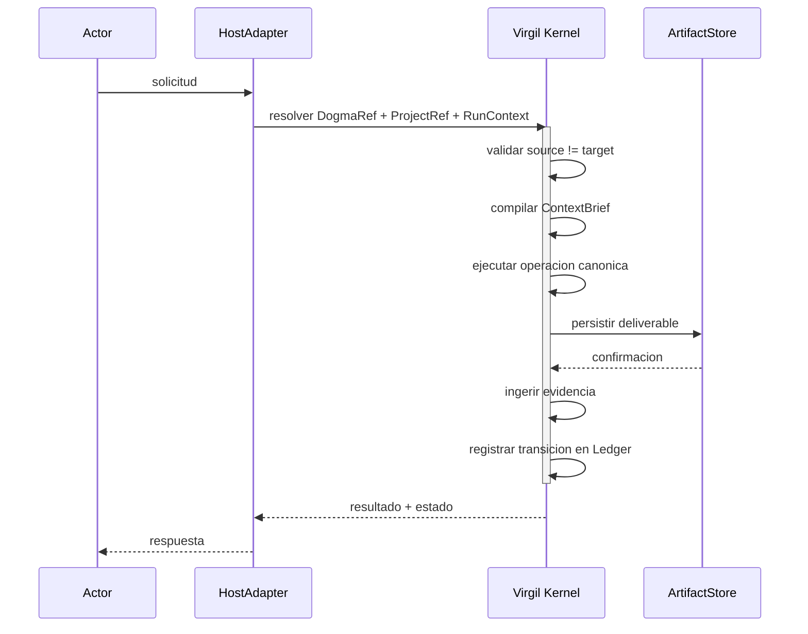

<!-- Virgil Principia
section_id: "3b"
title: "Flujo de una invocacion"
source: "principia/constitution.md"
source_lines: [291, 329]
layer: lifecycle
constitutional: true
actors: [PDC]
glossary_terms: [ContextBrief, Ledger, PDC, ARCH, DogmaRef, ProjectRef, RunContext]
depends_on: [3a, 9]
referenced_by: [7e, 7g, 11d, 4]
keywords:
  - flujo de invocacion
  - HostAdapter
  - Virgil Kernel
  - ArtifactStore
  - ContextBrief
  - Ledger
  - PDC
  - gates deterministas
  - certificacion
editorial_additions: [context_paragraph]
-->

> **Context:** Este flujo canonico ocurre dentro de cada transicion del ciclo de vida descrito en la seccion 3a. El PDC (Coherencia de Delegacion Orquestal) es un safeguard de orquestacion — importante distinguirlo de las gates de certificacion del pipeline de QA (Echo System, detallado en seccion 7), que son las unicas que determinan si el codigo esta certificado.

### 3b. Flujo de una invocacion

Este flujo canonico tiene pasos deterministas y pasos mediados por juicio. Las gates de certificacion (test pass/fail, mutation score, CRAP, coverage, CVE scan) son deterministas — binarias, sin subjetividad. Los pasos de planning, escalacion, compilacion de ContextBrief, alineacion arquitectonica y verificacion de coherencia (PDC) involucran juicio del agente orquestador, no son deterministas y deben dejar evidencia trazable. El Principia distingue ambos tipos explicitamente.

El PDC es un safeguard de coherencia de orquestacion que opera durante la ejecucion, pero NO es un gate de certificacion. La certificacion la determinan exclusivamente las gates del pipeline de QA definidas por el Kernel: gates mecanicas deterministas (seccion 7e, 11d) y verificacion estructurada de alineacion arquitectonica (seccion 7e, gate ARCH). Cuando el proyecto declara un perfil de compliance regulatoria, el review humano se agrega como gate blocking adicional (seccion 7g). El PDC puede detener una delegacion incoherente, pero no certifica ni aprueba codigo.

> **Identidades de invocacion**: `DogmaRef`, `ProjectRef` y `RunContext` son las tres identidades que el HostAdapter resuelve al inicio de cada invocacion. Este Principia las nombra como participantes del flujo canonico pero no especifica sus campos — ese contrato pertenece al layer de protocolo (docs/protocol/).

> **Atomicidad**: el flujo muestra pasos secuenciales (persistir →
> ingerir evidencia → registrar transicion). Si el proceso falla entre
> pasos, el mecanismo de recovery (seccion 10) reconcilia el estado
> derivando la fase actual desde los deliverables existentes, no desde
> un puntero almacenado. El Ledger implementa idempotencia: registrar
> una transicion ya registrada es un no-op.

Detras de cada paso hay un principio deliberado que descubrimos a continuación.
