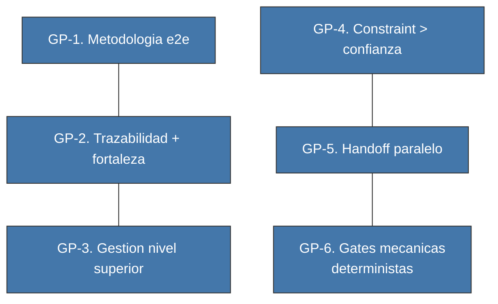
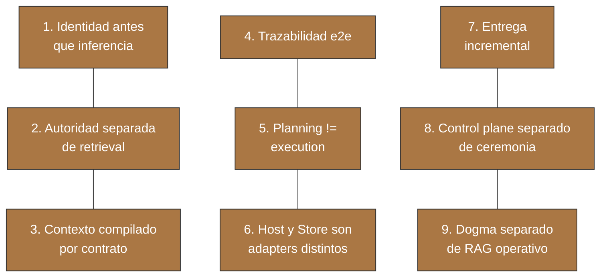
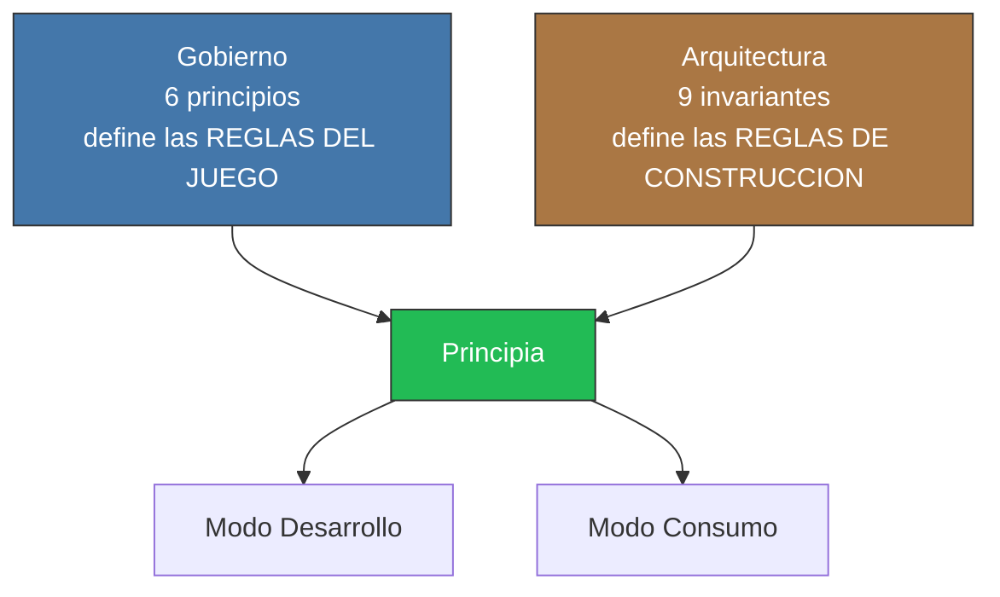

<!-- Virgil Principia
section_id: "4"
title: "Por que actua asi — Gobierno y Arquitectura"
source: "principia/constitution.md"
source_lines: [332, 416]
layer: principles
constitutional: true
actors: []
glossary_terms: [Gobierno, Arquitectura, Principia, Modo Desarrollo, Modo Consumo, ARCH]
depends_on: ["3b"]
referenced_by: ["5", "7e", "11d"]
keywords:
  - gobierno
  - arquitectura
  - principios de gobierno
  - invariantes arquitectonicas
  - constraint sobre confianza
  - handoff paralelo
  - gates mecanicas deterministas
  - identidad antes que inferencia
  - trazabilidad end-to-end
  - Modo Desarrollo
  - Modo Consumo
-->

**En este chunk:**
- [4a. Gobierno — COMO se gobierna](#4a-gobierno--como-se-gobierna)
- [4b. Arquitectura — COMO se construye](#4b-arquitectura--como-se-construye)
- [4c. Como se relacionan las dos capas](#4c-como-se-relacionan-las-dos-capas)

## 4. Por que actua asi

[↑ Volver al indice](../README.md)

Dos capas de principios complementarias. No se mezclan.

### 4a. Gobierno — COMO se gobierna

| # | Principio | En una frase |
|---|-----------|-------------|
| 1 | Metodologia e2e | Idea → codigo certificado → operacion. Sin saltos. |
| 2 | Trazabilidad + fortaleza | No basta que el enlace exista; debe ser fuerte. |
| 3 | Gestion nivel superior | Dashboard de salud, no revision linea a linea. |
| 4 | Constraint > confianza | Constraints enforceables y gates, no promesas del agente. |
| 5 | Handoff paralelo | Claiming sobre un handoff, no handoffs separados. |
| 6 | Gates mecanicas deterministas | Binario en ejecucion: pasa o no pasa. Planning y escalacion involucran juicio; la verificacion estructurada (ARCH) queda acotada y trazable (ver 7e). |

### 4b. Arquitectura — COMO se construye

### 4c. Como se relacionan las dos capas

Ambas capas de principios confluyen en el Principia. Lo que falta es conocer sus componentes: qué piezas implementan estas reglas.
