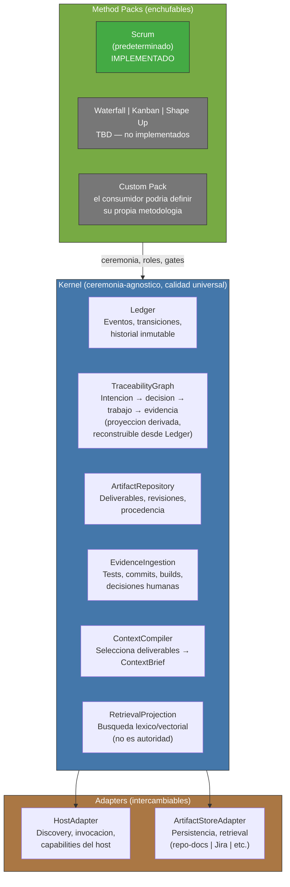

<!-- Virgil Principia
section_id: "5"
title: "Que partes lo componen"
source: "principia/overview.md"
source_lines: [419, 459]
layer: components
constitutional: true
actors: []
glossary_terms: [Kernel, Ledger, TraceabilityGraph, ArtifactRepository, EvidenceIngestion, ContextCompiler, RetrievalProjection, HostAdapter, ArtifactStoreAdapter, Method Pack, ContextBrief]
depends_on: ["4"]
referenced_by: ["6", "8", "10"]
keywords:
  - componentes
  - Kernel
  - Adapters
  - Method Packs
  - Ledger
  - TraceabilityGraph
  - ArtifactRepository
  - EvidenceIngestion
  - ContextCompiler
  - RetrievalProjection
  - HostAdapter
  - ArtifactStoreAdapter
  - Scrum
  - ceremonia-agnostico
  - calidad universal
editorial_additions: [context_paragraph]
-->

> **Context:** La distincion entre "calidad universal" (Kernel) y "ceremonia" (Method Pack) proviene de las dos capas de principios descritas en la seccion 4: gobierno (reglas del juego) y arquitectura (reglas de construccion). Este catalogo de componentes es donde ambas capas se materializan en piezas concretas.

## 5. Que partes lo componen

[↑ Volver al indice](../README.md)

Cada componente tiene una responsabilidad clara. El Kernel impone invariantes de calidad universales (Echo, testing, binding layer) independientemente de la metodologia. El Method Pack define la ceremonia: cuantos roles participan, que gates ceremoniales se comprimen, como se itera. La calidad es del Kernel; la ceremonia es del Pack.

Los Method Packs heredan los gates de calidad (Red/Green/Refactor, mutation testing, fitness functions) como invariantes universales no negociables. Un Pack puede definir mecanismos de calidad ADICIONALES pero no puede reducir el minimo del Kernel. "Ceremonia-agnostico" significa que el Pack elige la ceremonia (sprints, kanban boards, ciclos de Shape Up); "calidad universal" significa que el pipeline de verificacion R/G/R + fitness functions aplica sin excepcion, independientemente de la ceremonia elegida.
