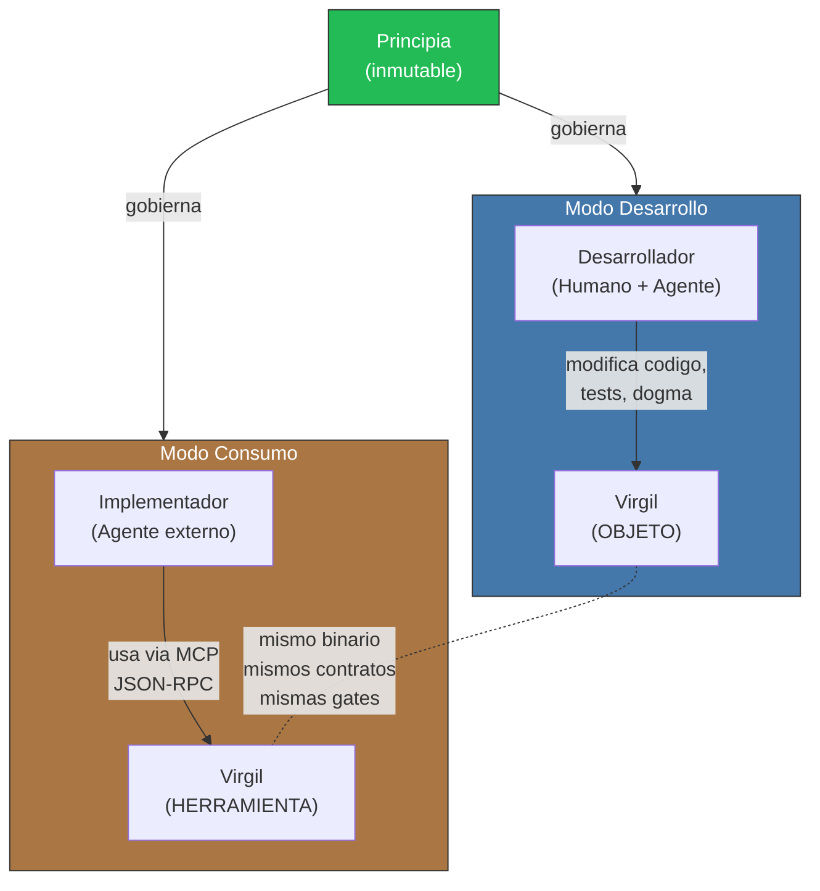
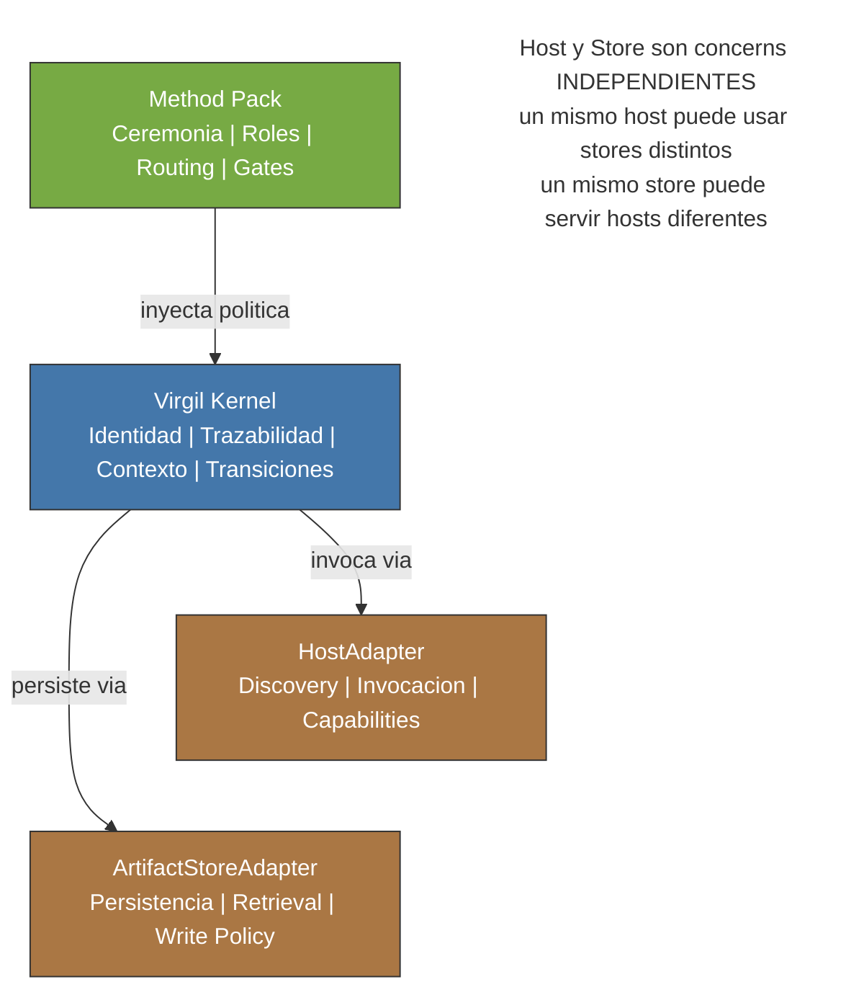
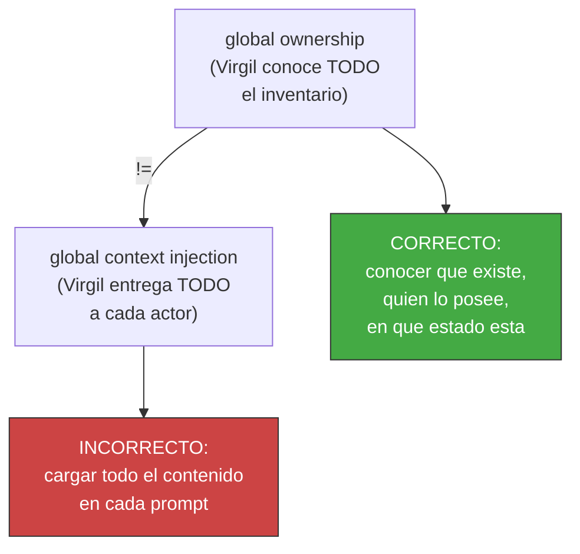

<!-- Virgil Principia
section_id: "6"
title: "Como interactuan las partes"
source: "principia/overview.md"
source_lines: [462, 534]
layer: interaction
constitutional: true
actors: [Desarrollador, Implementador]
glossary_terms: [Modo Desarrollo, Modo Consumo, Principia, Method Pack, HostAdapter, ArtifactStoreAdapter, global ownership, global context injection]
depends_on: ["5"]
referenced_by: ["7"]
keywords:
  - actores y modos
  - Modo Desarrollo
  - Modo Consumo
  - separacion de concerns
  - Method Pack
  - HostAdapter
  - ArtifactStoreAdapter
  - global ownership
  - global context injection
  - invariante fundamental
  - MCP JSON-RPC
-->

> **Context:** Method Pack, HostAdapter y ArtifactStoreAdapter son los componentes descritos en la seccion 5 (catalogo de partes); aqui se muestra como esos componentes y los dos modos operativos de Virgil interactuan entre si sin mezclar responsabilidades.

**En este chunk:**
- [6a. Actores y modos](#6a-actores-y-modos)
- [6b. Separacion de concerns](#6b-separacion-de-concerns)
- [6c. Invariante fundamental](#6c-invariante-fundamental)

## 6. Como interactuan las partes

[↑ Volver al indice](../README.md)

### 6a. Actores y modos

### 6b. Separacion de concerns

Cada pieza tiene un ownership claro. No se mezclan.

### 6c. Invariante fundamental

Estas invariantes fundamentales — que Virgil conoce sin inflar contextos — se aplican de forma idéntica en ambos modos operativos, generando una propiedad notable: Virgil es tanto herramienta como objeto bajo las mismas reglas.
