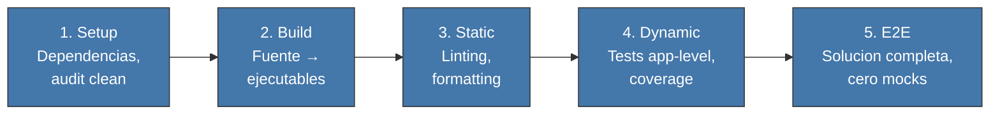

<!-- Virgil Principia
section_id: "7a"
title: "Echo System — pipeline determinista"
source: "principia/overview.md"
source_lines: [537, 576]
layer: quality
constitutional: true
actors: [SM, MIM]
glossary_terms: [Echo System, EchoRun, build artifact]
depends_on: []
referenced_by: [7b, 7c, 7e, 7h, 8f, 11a, 11f]
keywords:
  - Echo System
  - pipeline determinista
  - Setup
  - Build
  - Static
  - Dynamic
  - E2E
  - dev CI CD
  - triggers automaticos
  - pre-commit pre-push
-->

> **Context:** Esta seccion abre el capitulo 7 ("Como garantiza calidad"), que describe ocho mecanismos de accountability anidados. El primero es el Echo System, el pipeline determinista que produce los build artifacts que las demas gates consumen.

## 7. Como garantiza calidad

Ocho mecanismos forman un ciclo de accountability anidado. Ninguno
funciona aislado.

### 7a. Echo System — pipeline determinista

Secuencia de 5 pasos que se ejecuta en TODO ambiente (dev, CI, CD).
Los pasos son siempre los mismos y en el mismo orden. Lo que varia
es el scope (dev prioriza feedback rapido, CI prioriza completitud).

| Ambiente | Scope | Trigger por defecto | Enforcement |
|----------|-------|---------------------|-------------|
| Dev | Selectivo, feedback rapido | git hooks | Pre-commit, pre-push |
| CI | Completo | Push, PR | Pipeline stages |
| CD | Confianza absoluta | Tag, merge a main | Deployment gates |

Los triggers son adapters de operacion y pueden cambiar por proyecto; **Echo no cambia**. Un proyecto puede disparar el mismo scope mediante hooks, CI, un runner local u otro mecanismo siempre que: (a) produzca el mismo contrato de Echo y sus build artifacts identificados, y (b) el trigger sea automatico — no omitible por el agente ejecutor.

En la configuracion por defecto, los hooks de pre-commit ejecutan verificaciones ESTRUCTURALES de feedback rapido (lint, type-check, formato, analisis estatico). Los tests de integracion contra stack real (tier App/Servicio) se ejecutan en pre-push o en el pipeline de CI, no en pre-commit. "Feedback rapido" en el contexto de Dev se refiere a las verificaciones estructurales, no a la suite completa de integracion.
