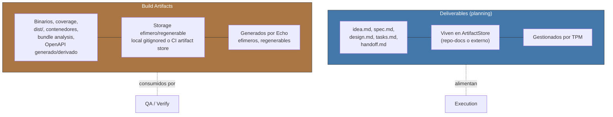

<!-- Virgil Principia
section_id: "7b"
title: "Deliverables vs Build Artifacts"
source: "principia/overview.md"
source_lines: [577, 617]
layer: quality
constitutional: true
actors: [TPM]
glossary_terms: [deliverable, build artifact, ArtifactStore, EchoRun, sourceRevision, buildArtifactSet, prePhase]
depends_on: [7a]
referenced_by: [8a, 8b, 11f]
keywords:
  - deliverables
  - build artifacts
  - ArtifactStore
  - ArtifactRepository
  - ArtifactStoreAdapter
  - PMBOK ISO 21500
  - DevOps CI-CD
  - trazabilidad de evidencia
  - OpenAPI
-->

> **Context:** Esta seccion pertenece al capitulo 7 ("Como garantiza calidad"). Distingue los outputs de planning (deliverables) de los outputs del Echo System descrito en 7a (build artifacts), una distincion terminologica que el resto del Principia asume como canonica.

### 7b. Deliverables vs Build Artifacts

Dos tipos de outputs que no deben confundirse. Los documentos de
planning son **deliverables** (PMBOK/ISO 21500). Los outputs del build
pipeline son **build artifacts** (DevOps/CI-CD). Virgil gestiona
deliverables; el Echo System genera build artifacts.

> **Nomenclatura**: el codigo de Virgil usa "Artifact" en entidades
> como ArtifactStore, ArtifactRepository y ArtifactStoreAdapter. Estas
> entidades gestionan **deliverables**, no build artifacts. La
> nomenclatura de codigo es historica; este Principia define la
> terminologia canonica.

> **Identidad de evidencia**: cada conjunto de build artifacts DEBE quedar ligado de forma inequívoca al `EchoRun` y a la `sourceRevision` que lo produjo. QA nunca certifica "el ultimo reporte" de forma implicita; certifica un `buildArtifactSet` atribuible a una revision concreta. La ubicacion fisica del artifact puede variar, su identidad y procedencia no.

> **OpenAPI**: el contrato fuente definido en `prePhase` es un deliverable/contrato normativo. Un OpenAPI JSON/YAML generado por build a partir de ese contrato o del codigo es un build artifact derivado. No comparten autoridad aunque puedan representar la misma interfaz.
