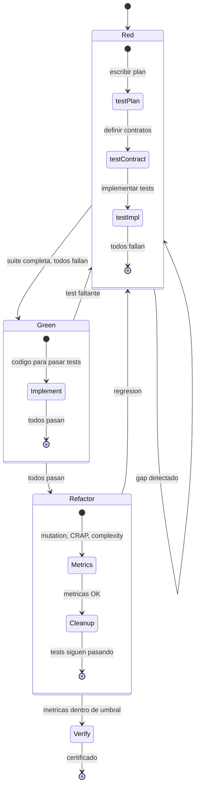

<!-- Virgil Principia
section_id: "7c-rgr"
title: "Macro Red/Green/Refactor — TDD por lotes"
source: "principia/constitution.md"
source_lines: [618, 661]
layer: quality
constitutional: true
actors: [SM]
glossary_terms: [Red, Green, Refactor, R0, R1, G1, F1, V1]
depends_on: [7a]
referenced_by: [7c-composite, 7d-tiers, 7d-binding, 11a-11b]
keywords:
  - macro TDD
  - Red Green Refactor
  - test plan
  - test contract
  - mutation testing
  - CRAP
  - gates R0 R1 G1 F1 V1
  - batch TDD
editorial_additions: [context_paragraph]
-->

> **Context:** Esta seccion pertenece al capitulo 7 ("Como garantiza calidad"), inmediatamente despues de la distincion deliverables vs build artifacts (7b). Describe el ciclo TDD macro que estructura la ejecucion de un batch completo, antes de introducir el compositeAgent que lo paraleliza (seccion 7c-composite).

### 7c. Macro Red/Green/Refactor — TDD por lotes

TDD a nivel de batch, no funcion por funcion. Primero TODA la suite de
tests, luego TODA la implementacion, luego TODO el refactoring.

El dogma actual define 5 gates dentro de este ciclo:
**R0** (handoff completo) → **R1** (red valida) → **G1** (green
production-safe) → **F1** (refactor seguro) → **V1** (verify
independiente).
