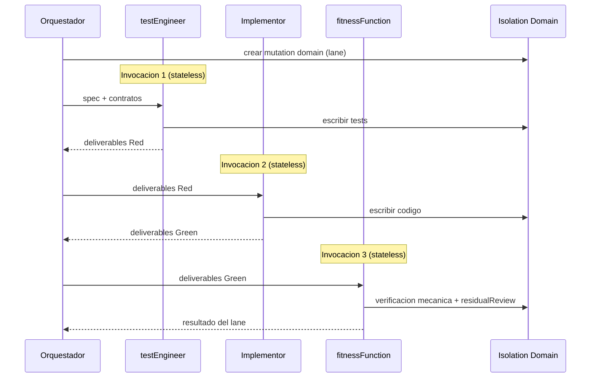

<!-- Virgil Principia
section_id: "7c-composite"
title: "compositeAgent — ejecucion paralela de R/G/R"
source: "principia/overview.md"
source_lines: [662, 711]
layer: quality
constitutional: true
actors: [SM, testEngineer, Implementor, fitnessFunction]
glossary_terms: [compositeAgent, mutation domain, worktree, delegationContract]
depends_on: [7c-rgr]
referenced_by: [8f, 11c]
keywords:
  - compositeAgent
  - mutation domain
  - worktree
  - aislamiento de filesystem
  - invocacion stateless
  - invariante de independencia
  - GP-4 constraint sobre confianza
  - lanes paralelos
-->

> **Context:** Continua directamente la seccion 7c (Macro Red/Green/Refactor). Cuando la ejecucion de un batch se paraleliza en multiples lanes, cada lane usa un compositeAgent para atravesar Red/Green/Refactor dentro de un dominio aislado. Los mutation domains tambien se mencionan en las secciones 8f (grafo estructural del codigo) y 11c (git strategy).

#### compositeAgent — ejecucion paralela de R/G/R

Cuando la ejecucion se paraleliza en multiples lanes, cada lane opera
dentro de un **mutation domain aislado** y recibe un compositeAgent: un
sub-agente que asume multiples personalidades secuencialmente dentro de
ese mismo dominio, evitando conflictos de filesystem. Worktrees son la
implementacion de referencia del Dogma actual. El invariante del
Principia es el aislamiento, no el mecanismo: un mutation domain valido
debe proveer (a) filesystem aislado que no interfiera con otros lanes,
(b) deteccion de conflictos al integrar, y (c) identidad de revision
por lane.

| Fase | Invocacion | Responsabilidad |
|------|-----------|-----------------|
| Red | testEngineer (sesion independiente) | Escribir tests segun spec |
| Green | Implementor (sesion independiente) | Codigo que pase los tests |
| Refactor | fitnessFunction (sesion independiente) | Mutation, CRAP, complejidad + residualReview |

Un compositeAgent NO es un agente monolitico — es una SECUENCIA de
invocaciones independientes orquestadas bajo una etiqueta comun.
Cada fase tiene su propio contrato y criterio de salida.

**Invariante de independencia**: cada fase del compositeAgent (testEngineer, Implementor, fitnessFunction) se ejecuta como invocacion independiente del agente — nueva sesion, sin historial conversacional. El Kernel implementa este reset como constraint tecnico (invocacion stateless por fase), no como instruccion al agente. Cada fase recibe unicamente los deliverables y build artifacts producidos por la fase anterior, no la historia de razonamiento. Este mecanismo satisface el Principio GP-4 (constraint > confianza): la independencia es estructural, no una promesa de comportamiento.
