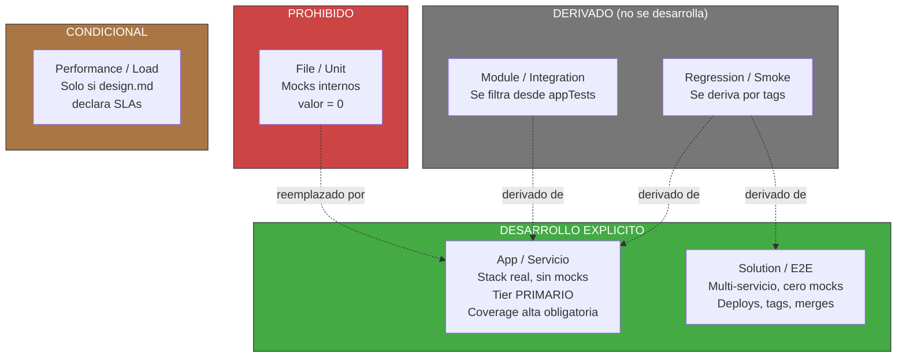

<!-- Virgil Principia
section_id: "7d-tiers"
title: "Testing Matrix — modelo de boundaries"
source: "principia/overview.md"
source_lines: [712, 750]
layer: quality
constitutional: true
actors: []
glossary_terms: [Testing Matrix, File/Unit, Module/Integration, App/Servicio, Solution/E2E, Performance/Load, T0, T1, T2]
depends_on: [7c-rgr]
referenced_by: [7d-binding, 7e, 7f]
keywords:
  - testing matrix
  - boundary de mocks
  - piramide de testing
  - App/Servicio tier primario
  - Solution E2E
  - cero mocks
  - T0 protocol app replay
  - T1 agent-in-the-loop
  - T2 host-adapter conformance
editorial_additions: [context_paragraph]
-->

> **Context:** Pertenece al capitulo 7 ("Como garantiza calidad"), inmediatamente despues del ciclo Red/Green/Refactor (7c). Define donde debe ubicarse la frontera del mock para que un test tenga valor, reemplazando la piramide de testing clasica por un modelo de boundaries.

### 7d. Testing Matrix — modelo de boundaries

El valor de un test depende de DONDE se ubica la frontera del mock,
no de la piramide clasica.

El dogma actual de Virgil define ademas T0 (protocol/app replay),
T1 (agent-in-the-loop) y T2 (host-adapter conformance) como niveles
especificos para validar el propio Virgil.
