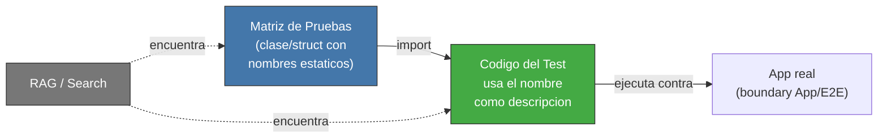

<!-- Virgil Principia
section_id: "7d-binding"
title: "Binding Layer — confianza del enlace"
source: "principia/constitution.md"
source_lines: [751, 792]
layer: quality
constitutional: true
actors: []
glossary_terms: [Binding Layer, declared, inferred, verified, AC]
depends_on: [7c-rgr, 7d-tiers]
referenced_by: [11f]
keywords:
  - trazabilidad matriz codigo
  - RAG-searchable
  - Binding Layer
  - declared inferred verified
  - mutation testing confirma fortaleza
  - static readonly
  - acceptance criteria
editorial_additions: [context_paragraph]
-->

> **Context:** Cierra la seccion 7d (Testing Matrix), continuando el capitulo 7 ("Como garantiza calidad"). Describe primero como los casos de prueba definidos como matriz durante Red se enlazan al codigo del test, y luego los tres niveles de confianza (Binding Layer) que ese enlace atraviesa durante el ciclo R/G/R descrito en 7c. El detalle completo del Binding Layer vive en su propio documento y tambien se referencia en la seccion 11f (evidencia como dato queryable).

#### Patron de trazabilidad: matriz → codigo

Durante Red, los casos de prueba se definen como una matriz con
nombres estaticos. El codigo de la prueba importa esos nombres. Esto
crea un enlace RAG-searchable desde la matriz documentada hasta la
implementacion del test.

El patron es agnostico de tecnologia: en TypeScript es una clase con
`static readonly`, en Go seria un `const` block o struct, en Rust un
`mod` con constantes. Lo que importa es que la matriz y el test
compartan un identificador rastreable.

#### Binding Layer — confianza del enlace

El enlace entre un test y el codigo que lo satisface no es binario
(existe/no existe). Tiene tres niveles de confianza que progresan
durante el ciclo R/G/R:

| Estado | Fase | Garantiza |
|--------|------|-----------|
| declared | Red | El test existe y referencia un AC |
| inferred | Green | Un hook detecto que codigo ejercita el test |
| verified | Refactor | Mutation testing confirmo fortaleza real |

Solo `verified` certifica fortaleza — los demas solo confirman
existencia.
