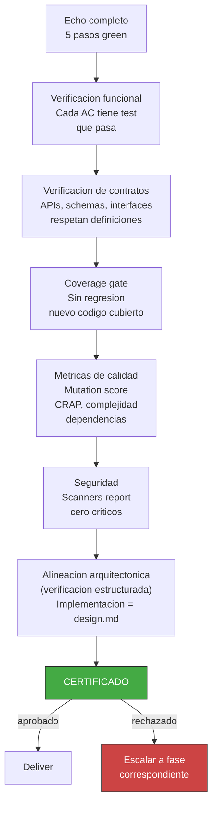

<!-- Virgil Principia
section_id: "7e"
title: "QA / Acceptance Gates — certificacion"
source: "principia/constitution.md"
source_lines: [793, 814]
layer: quality
constitutional: true
actors: [QA]
glossary_terms: [gate mecanica, gate de verificacion estructurada, ARCH, CERTIFICADO]
depends_on: [7a, 7d-tiers, 3b, 4]
referenced_by: [11e-routing, 1a, 11a-11b, 11d]
keywords:
  - QA
  - acceptance gates
  - certificacion
  - mutation score
  - CRAP
  - CVE scan
  - coverage gate
  - alineacion arquitectonica
  - comparacion semantica
  - escalar a fase
editorial_additions: [context_paragraph]
-->

> **Context:** Pertenece al capitulo 7 ("Como garantiza calidad"). Describe la gate final que certifica el resultado combinando verificaciones mecanicas deterministas (producidas por el Echo System de 7a) con verificacion estructurada de alineacion arquitectonica, sujeta al mismo deslinde epistemico descrito en la seccion 3b del Principia.

### 7e. QA / Acceptance Gates — certificacion

La certificacion combina gates mecanicas deterministas (test pass/fail, mutation score, coverage, CRAP, CVE scan, tamano de modulo) y gates de verificacion estructurada (alineacion arquitectonica). Las gates mecanicas son binarias: pasan o no pasan. Las gates de verificacion estructurada (ARCH: implementacion alineada con design.md) utilizan comparacion semantica documentada y trazable, sujeta al mismo deslinde de la seccion 3b.

