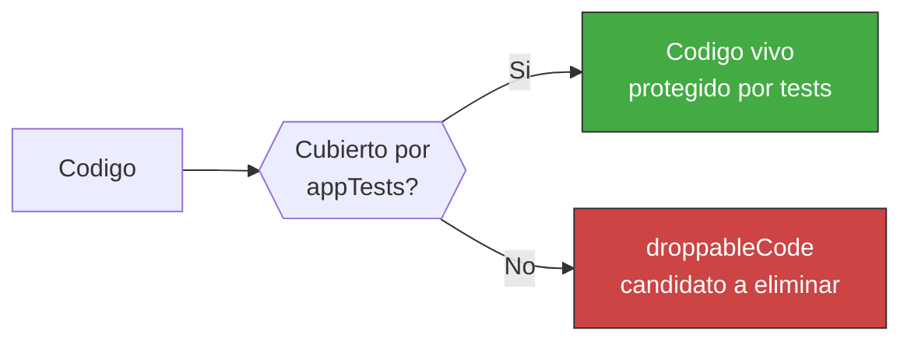

<!-- Virgil Principia
section_id: "7f"
title: "droppableCode — cobertura como herramienta"
source: "principia/constitution.md"
source_lines: [815, 842]
layer: quality
constitutional: true
actors: [MIM]
glossary_terms: [droppableCode, safeToAutoDelete, cobertura selectiva]
depends_on: [7d-tiers]
referenced_by: [7g]
keywords:
  - droppableCode
  - safeToAutoDelete
  - codigo muerto
  - coverage threshold
  - excepciones documentadas
  - mutation testing excepciones
  - eliminacion mecanica automatica
editorial_additions: [context_paragraph]
-->

> **Context:** Pertenece al capitulo 7 ("Como garantiza calidad"). Usa la cobertura de tests del tier App/Servicio (definido en la seccion 7d, Testing Matrix) no como metrica de vanidad sino como detector de codigo muerto.

### 7f. droppableCode — cobertura como herramienta

Codigo con 0% de cobertura en appTests no tiene justificacion para
existir. La cobertura no es metrica de vanidad — es detector de
codigo muerto.

Codigo detectado como droppableCode debe eliminarse o justificar su existencia con una excepcion explicita, documentada y revisable. El concepto **safeToAutoDelete** identifica el subconjunto de droppableCode que cumple criterios mecanicos de eliminacion segura: **sin dependientes vivos, sin ejecucion observada durante N ciclos y sin cobertura transitiva**. safeToAutoDelete habilita eliminacion mecanica automatica; droppableCode sin esos criterios requiere decision humana (eliminar o justificar excepcion).

El threshold de cobertura es obligatorio y **nunca se reduce** sin
autorizacion explicita del MIM. Se mide solo sobre archivos con
logica real (cobertura selectiva). Excepciones documentadas: codigo
defensivo para failure modes raros, paths de feature flags no activos,
boilerplate de adapters para interfaces externas aun no ejercitadas,
y codigo legado en proceso de migracion. Cada excepcion requiere un
tag explicito en el archivo y revision periodica.

El mismo mecanismo de excepcion aplica a mutation testing: el MIM puede autorizar excepciones documentadas para codigo donde mutation testing es computacionalmente prohibitivo (test suites de integracion pesada, codigo generado, adapters de terceros). Cada excepcion requiere tag explicito, justificacion y revision periodica. Los umbrales de mutation score siguen siendo no-relajables para el codigo no exceptuado.
