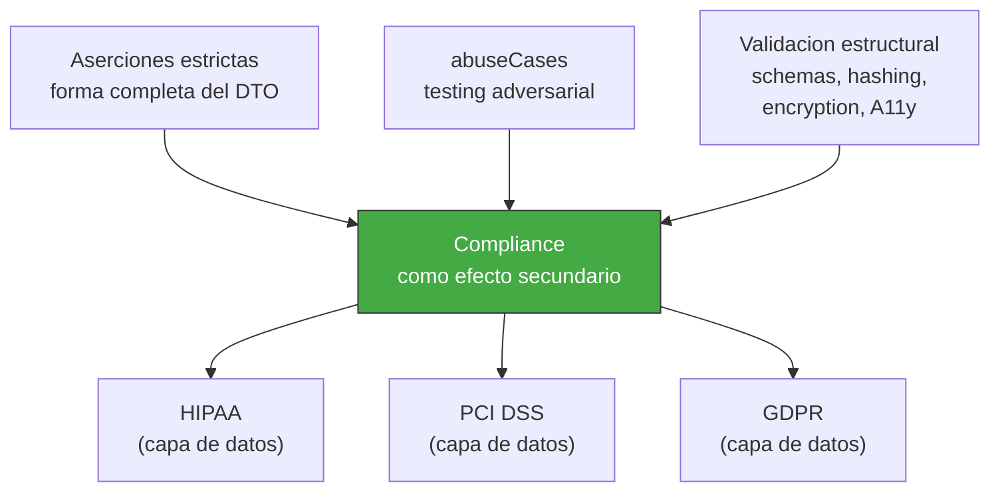

<!-- Virgil Principia
section_id: "7g"
title: "complianceByDesign — compliance como efecto secundario"
source: "principia/overview.md"
source_lines: [843, 868]
layer: quality
constitutional: false
actors: [MIM]
glossary_terms: [complianceByDesign, abuseCases, perfil de compliance]
depends_on: [7f]
referenced_by: [11d]
keywords:
  - complianceByDesign
  - aserciones estrictas de DTO
  - abuseCases
  - validacion estructural
  - HIPAA
  - PCI DSS
  - GDPR
  - review humano obligatorio
  - gate blocking regulatoria
editorial_additions: [context_paragraph]
-->

> **Context:** Pertenece al capitulo 7 ("Como garantiza calidad"). Es condicional: la capacidad tecnica descrita aqui es universal, pero la activacion del gate de review humano depende de si el proyecto declara un perfil de compliance regulatoria — de ahi que este chunk no sea constitucional en el mismo sentido que los mecanismos mecanicos de calidad.

### 7g. complianceByDesign — compliance como efecto secundario

Si cada test aserta la forma EXACTA del DTO (campos presentes, campos
ausentes, tipos), se obtiene verificacion de compliance sin suites
separadas.

Alcance: cubre EXCLUSIVAMENTE la capa de controles tecnicos de datos
(minimizacion, control de acceso por campo, validacion de forma). NO
cubre controles organizacionales, fisicos, legales, procedimentales
ni segregacion de responsabilidades. Cuando el proyecto declara un perfil de compliance regulatoria (HIPAA, PCI DSS, GDPR), el Method Pack DEBE activar review humano obligatorio sobre logica de autorizacion y modelado de dominio como gate blocking. Esta activacion es automatica para perfiles regulados, no opt-in. Para proyectos sin perfil regulatorio, el review humano permanece opcional y no-blocking. El Principia define la capacidad tecnica; el perfil de compliance del proyecto determina si el review humano es requerido.
