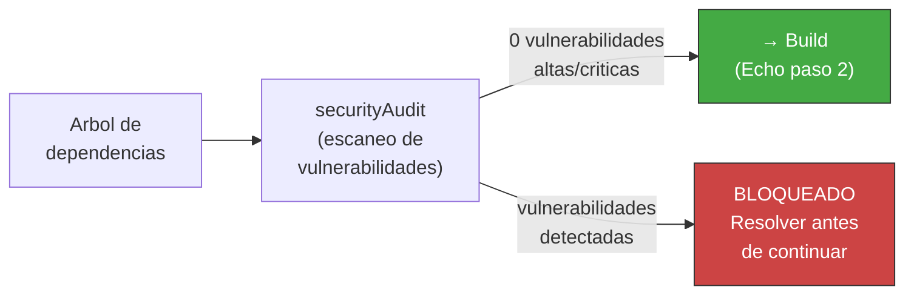

<!-- Virgil Principia
section_id: "7h-pinning"
title: "Supply Chain Integrity — versionPinning y securityAudit"
source: "principia/overview.md"
source_lines: [869, 908]
layer: quality
constitutional: true
actors: []
glossary_terms: [versionPinning, securityAudit, lock file]
depends_on: [7a]
referenced_by: [7h-bump]
keywords:
  - supply chain integrity
  - versionPinning
  - version exacta
  - lock file
  - securityAudit
  - escaneo de vulnerabilidades
  - gate blocking Setup
  - pnpm audit go vuln cargo audit pip-audit
editorial_additions: [context_paragraph]
-->

> **Context:** Abre la seccion 7h del capitulo 7 ("Como garantiza calidad"), sobre integridad de la cadena de suministro. El securityAudit descrito aqui es una gate blocking del paso 1 (Setup) del Echo System definido en la seccion 7a.

### 7h. Supply Chain Integrity — dependencias seguras

Las dependencias externas son superficie de ataque y fuente de tech debt. Virgil impone tres invariantes sobre la cadena de suministro, agnosticos de lenguaje y plataforma.

#### versionPinning — reproducibilidad absoluta

Todas las dependencias se declaran con version EXACTA (sin rangos, sin prefijos de compatibilidad). El gestor de dependencias y su version tambien se declaran de forma explicita en el proyecto.

| Invariante | Que significa | Por que |
|------------|--------------|---------|
| Version exacta | `1.2.3`, nunca `^1.2.3` ni `~1.2.3` | Elimina version drift entre ambientes. Lo que pasa en CI es lo que corre en produccion |
| Gestor de dependencias versionado | Version del gestor pinneada al proyecto | Garantiza paridad de resolucion de dependencias en todos los ambientes |
| Lock file como artefacto | El lock file se versiona y se respeta como fuente de verdad | Captura el arbol completo de dependencias transitivas |

El invariante aplica independientemente del ecosistema (npm/pnpm/yarn, Go modules, Cargo, pip/uv, Maven/Gradle, etc.). La implementacion concreta varia; el principio es universal: **cero ambiguedad en versiones**.

#### securityAudit — gate de dependencias

Antes de construir, se ejecuta un escaneo de vulnerabilidades sobre el arbol de dependencias. Esta verificacion es una gate BLOCKING del paso 1 (Setup) del Echo System (seccion 7a).

| Ambiente | Comportamiento |
|----------|---------------|
| Dev | Pre-push hook — alerta, no bloquea |
| CI | Pipeline stage — gate blocking |
| CD | Deployment gate — bloqueo absoluto |

El umbral de severidad (high, critical, o ambos) lo define el Method Pack. El Kernel impone que el escaneo se ejecute; el Pack decide el umbral. La herramienta de escaneo es agnostica: cada ecosistema tiene su equivalente (`pnpm audit`, `go vuln check`, `cargo audit`, `pip-audit`, `mvn dependency-check`, etc.).
