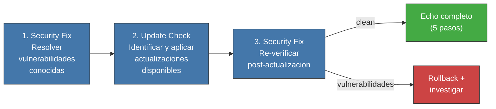

<!-- Virgil Principia
section_id: "7h-bump"
title: "bumpDependencies y el ciclo cerrado de calidad"
source: "principia/overview.md"
source_lines: [909, 948]
layer: quality
constitutional: true
actors: [MIM]
glossary_terms: [bumpDependencies, ciclo cerrado]
depends_on: [7h-pinning]
referenced_by: []
keywords:
  - bumpDependencies
  - tech debt
  - update check
  - security fix
  - rollback
  - mantenimiento de dependencias
  - ciclo cerrado
  - QA certifica resultado
-->

> **Context:** Cierra la seccion 7h del capitulo 7 ("Como garantiza calidad"), sobre integridad de la cadena de suministro. Complementa el versionPinning y securityAudit descritos en la parte anterior de 7h: mientras esos invariantes fijan versiones exactas, bumpDependencies es el proceso controlado que las actualiza sin reintroducir riesgo. La ultima subseccion ("Ciclo cerrado") resume como se articulan todos los mecanismos del capitulo 7.

#### bumpDependencies — mitigacion controlada de tech debt

Las versiones exactas previenen drift pero acumulan tech debt si no se actualizan. El ciclo bumpDependencies resuelve esta tension con un proceso de tres pasos:

1. **Security Fix**: resolver vulnerabilidades conocidas en las versiones actuales
2. **Update Check**: ejecutar un verificador de actualizaciones que identifique versiones nuevas de todas las dependencias, aplicando las actualizaciones con version exacta (sin introducir rangos)
3. **Security Fix**: re-ejecutar el escaneo de seguridad contra las versiones actualizadas — una actualizacion puede INTRODUCIR vulnerabilidades nuevas

Despues del ciclo completo, el Echo System se ejecuta integro (5 pasos). Si alguna gate falla, se revierte la actualizacion y se investiga la causa.

bumpDependencies no es un paso del Echo — es un proceso de mantenimiento que PRECEDE al Echo. Se ejecuta de forma explicita (no automatica), tipicamente en una cadencia definida por el equipo (semanal, por sprint, o pre-release). El MIM puede delegar la cadencia al Method Pack.

### Ciclo cerrado

Estos mecanismos forman un ciclo cerrado: el Echo ejecuta, los build
artifacts capturan outputs, Red/Green/Refactor estructura la ejecucion
(paralelizable via compositeAgent), la Testing Matrix define que vale
como prueba, droppableCode detecta codigo muerto, complianceByDesign
verifica cumplimiento, Supply Chain Integrity asegura dependencias
seguras y actualizadas, y QA certifica el resultado. Si QA rechaza, se
escala a la fase que corresponda.
