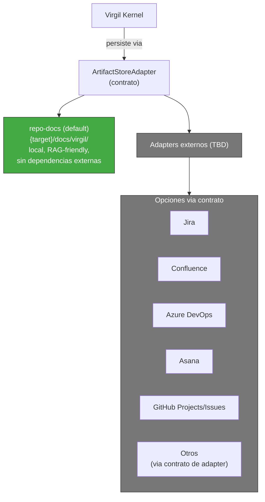
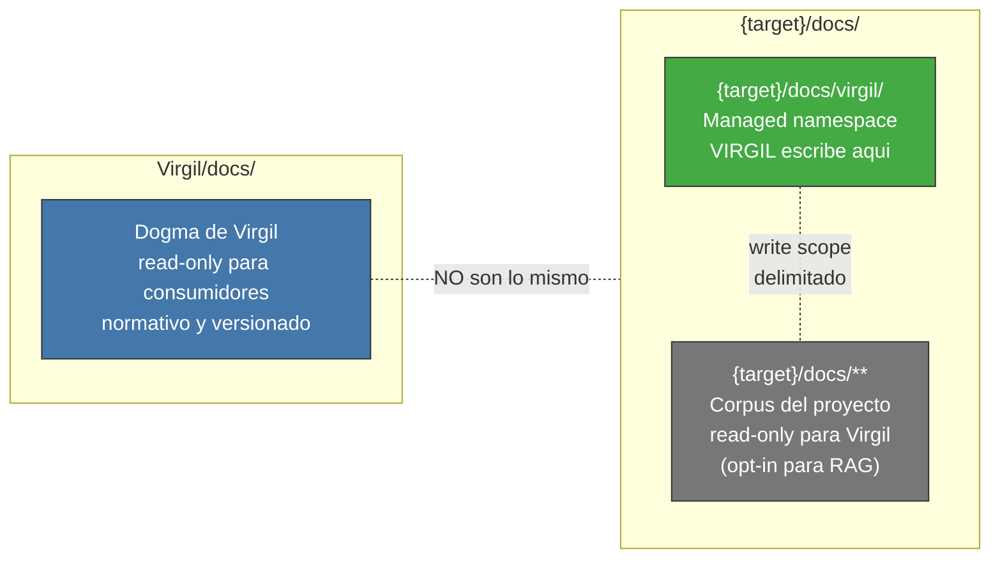

<!-- Virgil Principia
section_id: "8"
title: "Donde vive el conocimiento"
source: "principia/constitution.md"
source_lines: [951, 1024]
layer: knowledge
constitutional: true
actors: []
glossary_terms: [ArtifactStore, RAG, codebaseMemory, watermark, re-sync, ArtifactStoreAdapter]
depends_on: ["5", "7b"]
referenced_by: ["8c-dbms", "8c-watermark", "8c-dual", "8d-8e", "8f-concept", "8f-construction"]
keywords:
  - ArtifactStore
  - RAG
  - codebaseMemory
  - watermark
  - re-sync
  - namespaces
  - persistencia
  - DBMS del contexto
  - grafo estructural
editorial_additions: [context_paragraph]
-->

> **Context:** Introduce los tres concerns de gestion de conocimiento en Virgil — persistencia (ArtifactStore), consulta documental (RAG) y comprension estructural del codigo (codebaseMemory) — que se desarrollan en detalle en las subsecciones siguientes (8c-8f).

## 8. Donde vive el conocimiento

Tres concerns separados: donde se PERSISTEN los deliverables
(ArtifactStore), como se CONSULTAN deliverables y documentacion (RAG),
y como se COMPRENDE la estructura del codigo (codebaseMemory). El RAG
actua como DBMS del contexto documental; el codebaseMemory actua como
grafo estructural del codigo. Ambas proyecciones son **versionadas**:
declaran un watermark (la revision contra la cual estan sincronizadas)
y pueden detectar drift respecto al estado actual del repositorio.

El camino canonico de contextualizacion es consultar la herramienta
apropiada con queries acotadas, no cargar archivos completos en el
prompt. La lectura directa de archivos no esta prohibida pero tiene
un costo: consume tokens innecesariamente y opera fuera de la
trazabilidad de Virgil. Toda modificacion que genere nuevos commits
fuera del flujo de Virgil desplaza HEAD mas alla del watermark y
requiere un **re-sync** que actualice la proyeccion. Ninguna
certificacion es valida si la proyeccion RAG no esta sincronizada
con la revision que se certifica.

### 8a. ArtifactStore — persistencia

### 8b. Separacion de namespaces

> **Invariante**: `Virgil/docs/` (dogma) y `{target}/docs/` (proyecto)
> comparten el nombre `docs` pero NO comparten identidad, ownership ni
> write policy.
