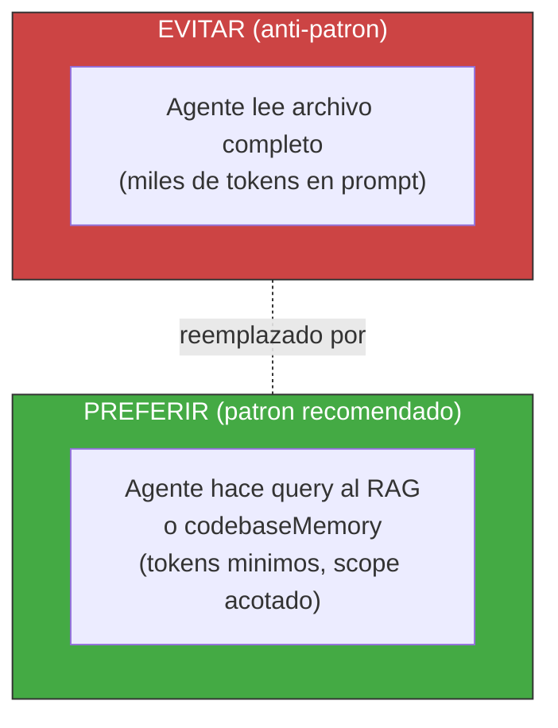

<!-- Virgil Principia
section_id: "8c-dbms"
title: "RAG dual — DBMS de contexto"
source: "principia/constitution.md"
source_lines: [[1025, 1040], [1081, 1096]]
source_lines_note: "Non-contiguous. Lines 1041-1080 (drift/re-sync mechanisms + first mermaid diagram) belong to chunk 8c-watermark (23). Lines 1034-1040 (the '#### Watermark y re-sync' heading and its lead sentence) are duplicated verbatim in chunk 23, which owns the full 1034-1080 range including body content."
layer: knowledge
constitutional: true
actors: []
glossary_terms: [RAG, codebaseMemory, watermark, AGENTS.md]
depends_on: ["8"]
referenced_by: ["8c-watermark", "8c-dual", "8f-concept"]
keywords:
  - RAG
  - DBMS de contexto
  - codebaseMemory
  - watermark
  - anti-patron
  - queries acotadas
  - ahorro de tokens
editorial_additions: [context_paragraph]
-->

> **Context:** El RAG y el codebaseMemory (grafo estructural del codigo, seccion 8f) son las dos proyecciones de conocimiento versionadas introducidas en la seccion 8. Este fragmento establece el principio arquitectonico de consultar en lugar de leer, y presenta el mecanismo de watermark que garantiza que esas proyecciones esten sincronizadas con el repositorio (mecanica detallada en la seccion 8c-watermark).

### 8c. RAG dual — DBMS de contexto

Principio arquitectonico: **los agentes consultan en lugar de leer**.
La arquitectura favorece queries al RAG (deliverables, documentacion)
y al codebaseMemory (estructura del codigo, seccion 8f) sobre lectura
directa de archivos. Virgil inyecta esta guia via AGENTS.md.
Contextualizacion via queries, no via prompts — ahorro directo de
tokens.

#### Watermark y re-sync

El RAG y el codebaseMemory mantienen un **watermark**: la revision
(commit SHA) contra la cual la proyeccion fue construida o
sincronizada por ultima vez. Este watermark es la base de tres
mecanismos:

