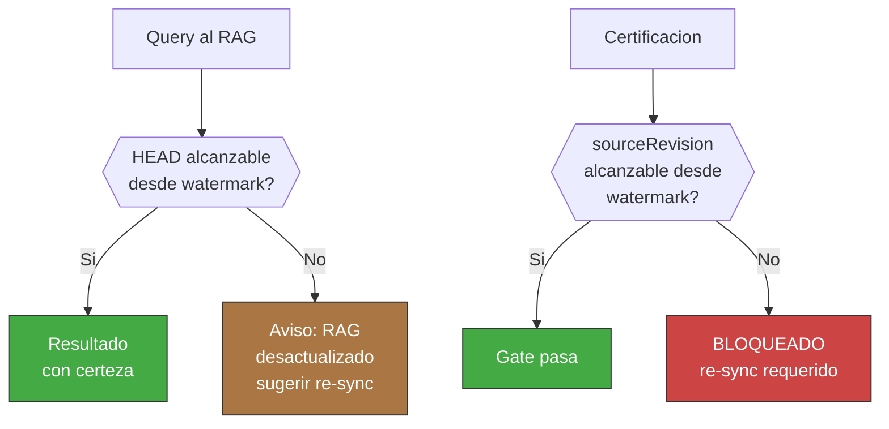

<!-- Virgil Principia
section_id: "8c-watermark"
title: "Watermark y re-sync"
source: "principia/overview.md"
source_lines: [1034, 1080]
layer: knowledge
constitutional: true
actors: [MIM]
glossary_terms: [watermark, re-sync, sourceRevision, drift]
depends_on: ["8", "8c-dbms"]
referenced_by: ["7b", "8f-construction", "11f"]
keywords:
  - watermark
  - re-sync
  - drift
  - certificacion
  - sourceRevision
  - HEAD
  - merge-base
  - Dogma
-->

> **Context:** El RAG (DBMS de contexto documental) y el codebaseMemory (grafo estructural del codigo, seccion 8f) son proyecciones versionadas del repositorio (seccion 8). El **watermark** es el commit SHA contra el cual una de esas proyecciones fue construida o sincronizada por ultima vez. Este mecanismo conecta con la cadena de certificacion descrita en las secciones 7b (deliverables vs build artifacts) y 11f (evidencia como dato queryable).

#### Watermark y re-sync

El RAG y el codebaseMemory mantienen un **watermark**: la revision
(commit SHA) contra la cual la proyeccion fue construida o
sincronizada por ultima vez. Este watermark es la base de tres
mecanismos:

1. **Deteccion de drift**: al recibir una query, la proyeccion compara
   su watermark contra el HEAD actual. Si hay divergencia, reporta:
   "ultimo sync: `{sha}`, `{N}` commits atras" y sugiere re-sync.
2. **Bloqueo de certificacion**: Virgil NO certifica codigo cuya
   `sourceRevision` no sea alcanzable desde el watermark del RAG. El
   invariante es mecanico: sourceRevision debe ser alcanzable desde
   watermark en el grafo de commits (equivalente a
   `git merge-base --is-ancestor sourceRevision watermark`). El
   watermark es propiedad exclusiva del Kernel y solo se actualiza
   como efecto de un re-sync que reconstruye o actualiza la
   proyeccion — un agente no puede modificar el watermark sin
   ejecutar el proceso de sincronizacion.
3. **Re-sync explicito**: el MIM o el agente puede disparar un re-sync
   que actualiza la proyeccion al HEAD actual. El trigger puede ser:
   - Explicito: el MIM instruye al agente ("sincroniza Virgil").
   - Via PR: el PR incluye deltas del RAG y firma de sync (la
     especificacion de la firma la define el Dogma); al merge, la
     proyeccion queda up-to-date sin intervencion manual.
   - Via hook (opt-in): un post-merge hook dispara re-sync
     automaticamente. Es decision del consumidor, no obligacion del
     Principia.

