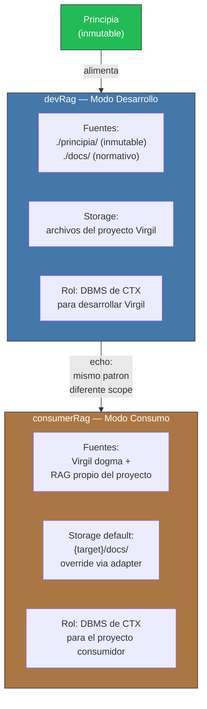

<!-- Virgil Principia
section_id: "8c-dual"
title: "devRag y consumerRag"
source: "principia/overview.md"
source_lines: [1097, 1135]
layer: knowledge
constitutional: false
actors: []
glossary_terms: [devRag, consumerRag, Principia, adapter]
depends_on: ["8", "8c-dbms"]
referenced_by: ["9"]
keywords:
  - devRag
  - consumerRag
  - modo desarrollo
  - modo consumo
  - adapter interfaces
  - Jira
  - Confluence
  - Azure DevOps
  - Asana
editorial_additions: [context_paragraph]
-->

> **Context:** El RAG opera como DBMS del contexto documental (seccion 8c). Virgil instancia ese mismo patron en dos variantes segun el modo operativo: `devRag` cuando se desarrolla el propio Virgil, y `consumerRag` cuando un proyecto consumidor lo utiliza.

Virgil define dos instancias del mismo patron RAG-como-DBMS, una por
cada modo operativo.

| Aspecto | devRag | consumerRag |
|---------|--------|-------------|
| Modo | Desarrollo | Consumo |
| Fuentes | `./principia/` + `./docs/` | Virgil dogma + RAG propio del proyecto |
| Storage | Archivos del proyecto Virgil | `{target}/docs/` (default) |
| Override | N/A (fuente fija) | Adapter interfaces: Jira, Confluence, Azure DevOps, Asana, WordPress, DBMS |
| Rol | DBMS de CTX para Virgil | DBMS de CTX para el proyecto consumidor |

El consumerRag define **interfaces** — el cliente las implementa con
el backend que necesite. Lo que se conecte, se conecta, mientras
cumpla con el contrato del adapter.
