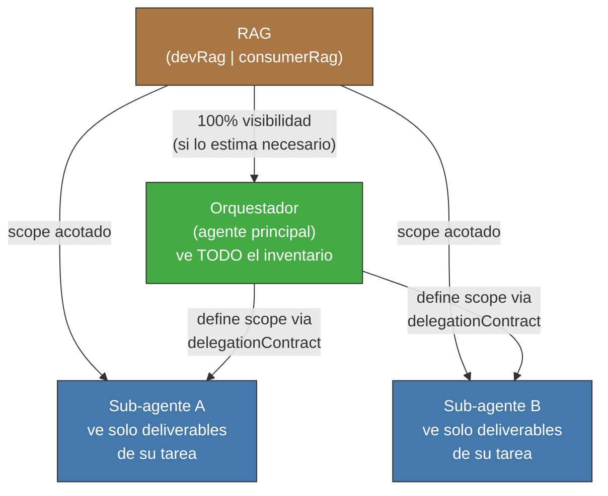
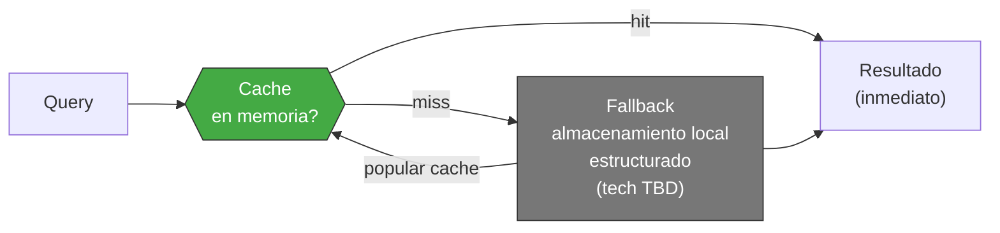

<!-- Virgil Principia
section_id: "8d-8e"
title: "Visibilidad escalonada y memoizacion"
source: "principia/overview.md"
source_lines: [1136, 1186]
layer: knowledge
constitutional: true
actors: [orquestador]
glossary_terms: [delegationContract, RAG, Ledger, ArtifactRepository, TraceabilityGraph]
depends_on: ["8"]
referenced_by: ["9", "10"]
keywords:
  - visibilidad escalonada
  - scope acotado
  - delegationContract
  - memoizacion
  - cache
  - Ledger
  - TraceabilityGraph
  - proyecciones derivadas
editorial_additions: [context_paragraph]
-->

> **Context:** El RAG (devRag | consumerRag, seccion 8c) es la proyeccion documental de Virgil. Estas subsecciones describen como se controla el acceso a esa proyeccion segun el rol del agente (visibilidad escalonada) y como se optimiza el rendimiento de las consultas (memoizacion), ademas de aclarar la relacion de autoridad entre el RAG y las fuentes autoritativas del sistema.

### 8d. Visibilidad escalonada

El agente principal (orquestador) tiene visibilidad completa del RAG
si asi lo estima necesario. Los sub-agentes reciben un scope reducido:
solo lo necesario para su tarea.

El scope del sub-agente se define en el `delegationContract` (seccion
9c). El orquestador decide que topic_keys o queries son visibles para
cada delegacion.

### 8e. Memoizacion

El RAG mantiene una capa de cache en memoria para acelerar queries
repetidas. Fallback a almacenamiento persistente cuando la cache se
invalida o la sesion se reinicia.

El RAG no es la autoridad del proceso — el Ledger, el
ArtifactRepository y la evidencia son la fuente de verdad. El RAG y
el TraceabilityGraph son proyecciones derivadas, reconstruibles desde
el Ledger y los deliverables. Ninguna proyeccion es fuente de verdad;
si se desincroniza, se reconstruye desde las fuentes autoritativas.
