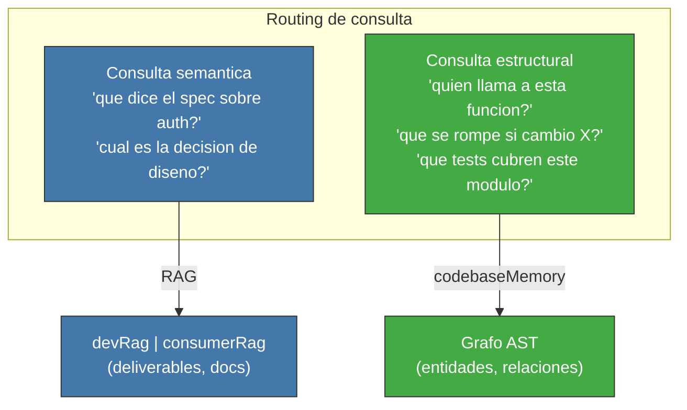

<!-- Virgil Principia
section_id: "8f-concept"
title: "codebaseMemory — grafo estructural del codigo"
source: "principia/constitution.md"
source_lines: [1187, 1210]
layer: knowledge
constitutional: true
actors: []
glossary_terms: [codebaseMemory, RAG, grafo AST]
depends_on: ["8", "8c-dbms"]
referenced_by: ["8f-construction", "9"]
keywords:
  - codebaseMemory
  - grafo AST
  - consulta semantica
  - consulta estructural
  - routing
  - RAG
editorial_additions: [context_paragraph]
-->

> **Context:** El RAG (seccion 8c) indexa deliverables y documentacion de forma semantica. El codigo fuente requiere un tratamiento distinto: esta subseccion introduce el codebaseMemory, la herramienta complementaria que mapea la estructura del codigo sin embeddings (la mecanica de construccion se detalla en la seccion 8f-construction).

### 8f. codebaseMemory — grafo estructural del codigo

El RAG opera sobre deliverables y documentacion — datos estructurados
que se indexan semanticamente. El codigo fuente es diferente: no se
puede (ni se debe) meterlo completo en un RAG. Para el codigo, Virgil
utiliza una herramienta complementaria: un grafo estructural
determinista que mapea relaciones sin embeddings.

