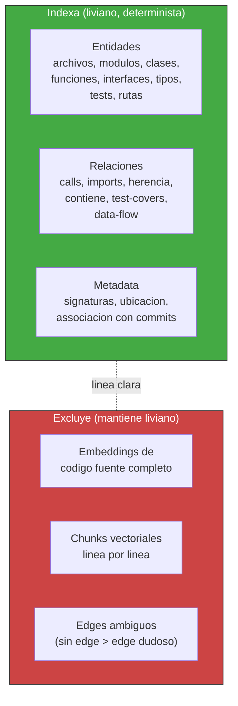
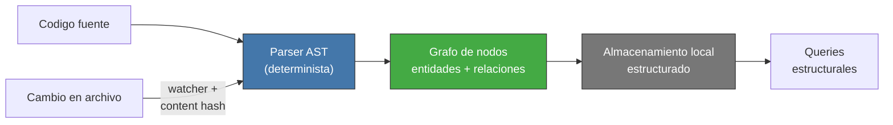
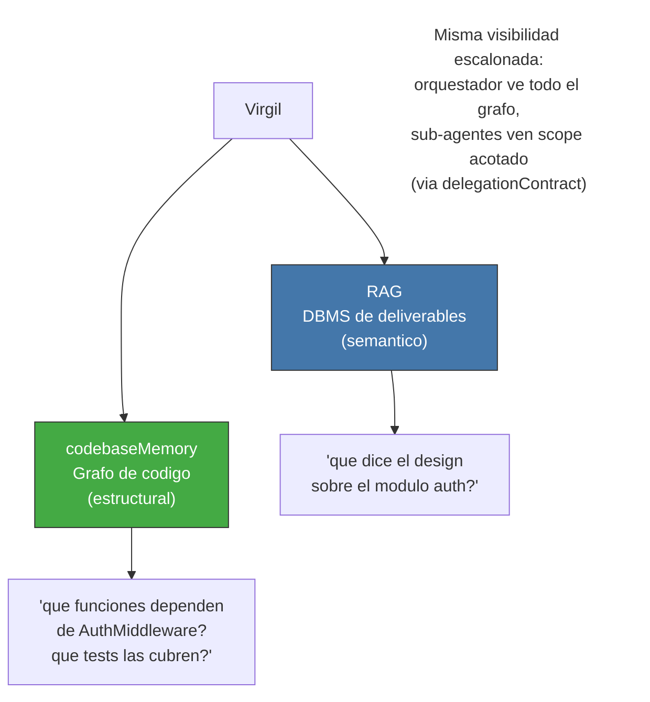

<!-- Virgil Principia
section_id: "8f-construction"
title: "codebaseMemory — construccion, indexado y watermark"
source: "principia/overview.md"
source_lines: [1211, 1298]
layer: knowledge
constitutional: true
actors: []
glossary_terms: [codebaseMemory, watermark, mutation domain, worktree, soundness conservadora]
depends_on: ["8f-concept", "8c-watermark"]
referenced_by: ["7c", "11c"]
keywords:
  - codebaseMemory
  - parser AST
  - construccion determinista
  - actualizacion incremental
  - file watcher
  - watermark
  - mutation domain
  - worktree
  - lanes paralelos
  - soundness conservadora
-->

> **Context:** El codebaseMemory (seccion 8f-concept) es el grafo estructural determinista que mapea entidades y relaciones del codigo, complementario al RAG (seccion 8c). Este fragmento detalla que indexa, como se construye, como se actualiza incrementalmente, y como mantiene su propio watermark (mecanismo compartido con el RAG, seccion 8c-watermark). Tambien conecta con los mutation domains aislados descritos en las secciones 7c y 11c.

#### Que indexa vs que excluye

El codebaseMemory indexa ESTRUCTURA, no contenido.

#### Construccion determinista

El grafo se construye por un parser AST determinista, no por inferencia
de un LLM. Esto garantiza cobertura determinista del corpus parseable,
velocidad y **soundness conservadora** de los edges: una relacion se
registra solo cuando existe evidencia estructural suficiente. Los edges
ambiguos se omiten; ausencia de edge no prueba ausencia de una relacion
runtime o dinamica.

La actualizacion es incremental: un file watcher detecta cambios,
compara hashes, y re-parsea solo los archivos modificados. No hay
rebuild completo en cada cambio.

#### Complemento del RAG, no reemplazo

El codebaseMemory habilita la visualizacion on-demand del proyecto
como un grafo de nodos — sin cargar codigo fuente en el prompt, sin
quemar tokens, y con ownership total de la estructura. Es la
herramienta que permite a Virgil "ver" el codigo sin "leerlo".

El codebaseMemory mantiene su propio watermark, independiente del RAG.
La actualizacion incremental via file watcher actualiza el watermark
automaticamente al commit que disparo el cambio. El invariante de
certificacion (seccion 8c) aplica a ambas proyecciones.

En escenarios de lanes paralelos (seccion 11c), cada mutation domain aislado mantiene su propia instancia del grafo. En la implementacion de referencia esos dominios son worktrees. Los grafos divergentes se reconcilian al integrar codigo: la revision integrada dispara reconstruccion incremental del grafo desde su AST. No hay grafo compartido entre lanes divergentes.
