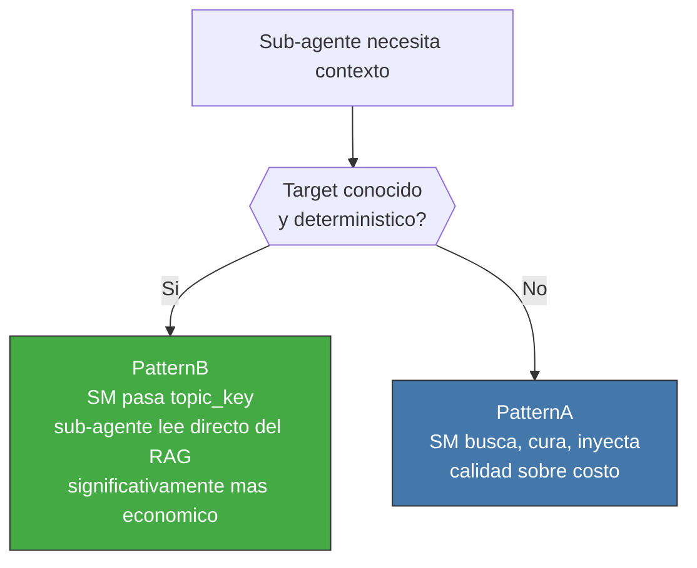
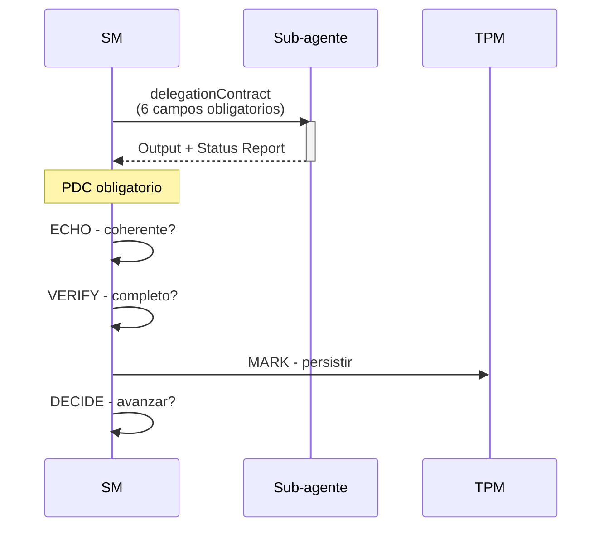

<!-- Virgil Principia
section_id: "9"
title: "Como fluye el contexto"
source: "principia/overview.md"
source_lines: [1301, 1382]
layer: context
constitutional: true
actors: [SM, sub-agente, TPM, ContextCompiler]
glossary_terms: [ContextBrief, ContextCompiler, PDC, delegationContract, circuitBreaker]
depends_on: ["8c", "8e", "8f"]
referenced_by: ["3b", "10", "11e"]
keywords:
  - ContextBrief
  - topic_key
  - PatternA
  - PatternB
  - delegacion
  - PDC
  - ECHO VERIFY MARK DECIDE
  - Status Report
  - circuitBreaker
  - devRag consumerRag
-->

> **Context:** Con el conocimiento organizado como DBMS documental (RAG), grafo estructural (codebaseMemory) y visibilidad escalonada por rol (seccion 8), el paso siguiente es entender como ese contexto fluye entre agentes durante la ejecucion.

**En este chunk:**
- [9a. ContextBrief](#9a-contextbrief)
- [9b. Dos patrones de entrega](#9b-dos-patrones-de-entrega)
- [9c. Delegacion: SM → sub-agente → PDC](#9c-delegacion-sm--sub-agente--pdc)

## 9. Como fluye el contexto

Regla fundamental: **nunca se pasa contexto crudo a un sub-agente**.
El contexto se entrega compilado (ContextBrief) o como referencia
(topic_key) para que el sub-agente lea del RAG.

### 9a. ContextBrief

El ContextCompiler selecciona deliverables, hechos y limites para
producir un ContextBrief acotado al objetivo del actor. La seleccion
queda trazable: que se incluyo, de donde salio, que se excluyo.

La compilacion del ContextBrief es un paso de juicio (seccion 3b) con superficie de alucinacion inherente: la seleccion/resumen puede omitir o distorsionar informacion. La trazabilidad (que se incluyo, de donde salio, que se excluyo) permite auditoria post-hoc, pero NO previene la omision en tiempo de compilacion. Este riesgo se mitiga con el PDC (coherence check post-delegacion) y con la reconstruccion del ContextBrief ante PlanningGapDetected.

### 9b. Dos patrones de entrega

| Patron | Cuando | Costo | Calidad |
|--------|--------|-------|---------|
| PatternB (default) | Target conocido, deterministico | Bajo (pasa `topic_key`; evita materializar contexto) | Buena |
| PatternA | Busqueda fuzzy, fan-out alto (8+) | Alto | Optima |

Ambos patrones operan sobre el RAG dual (seccion 8c): devRag en Modo
Desarrollo, consumerRag en Modo Consumo.

### 9c. Delegacion: SM → sub-agente → PDC

Los 6 campos obligatorios del delegationContract:

| Campo | Que define |
|-------|------------|
| Identidad | Nombre de rol, tier de razonamiento (busqueda / implementacion / arquitectura), constraints de comportamiento |
| Scope | Limite explicito del alcance — que archivos, que acciones, que esta fuera |
| Objetivo verificable | Criterio binario que el SM evalua contra el output |
| Input | Datos resueltos que el sub-agente necesita — sin referencias que deba perseguir |
| Output schema | Estructura exacta del resultado esperado |
| Reglas inyectadas | Reglas del proyecto y constraints como texto literal en el briefing — el sub-agente NO busca su propio contexto |

La **identidad** no es decorativa — define como razona y opera el
sub-agente. El tier de razonamiento se asigna por complejidad de la
tarea, no por preferencia: una busqueda no requiere capacidad
arquitectonica; una decision de diseno no se delega a capacidad de
busqueda. Las reglas llegan pre-digeridas porque un sub-agente sin
estado (GP-4: constraint > confianza) no tiene acceso al registro de
origen ni responsabilidad de buscarlo.

Sin Status Report en el output, el SM lo trata como FAILED.
Tres fallos consecutivos al mismo rol activan el circuitBreaker.

> **No confundir**: el paso `ECHO` del PDC valida coherencia del output delegado. El **Echo System** ejecuta Setup → Build → Static → Dynamic → E2E y produce build artifacts. El primero es un checkpoint de orquestacion; el segundo es el pipeline canonico de evidencia.
