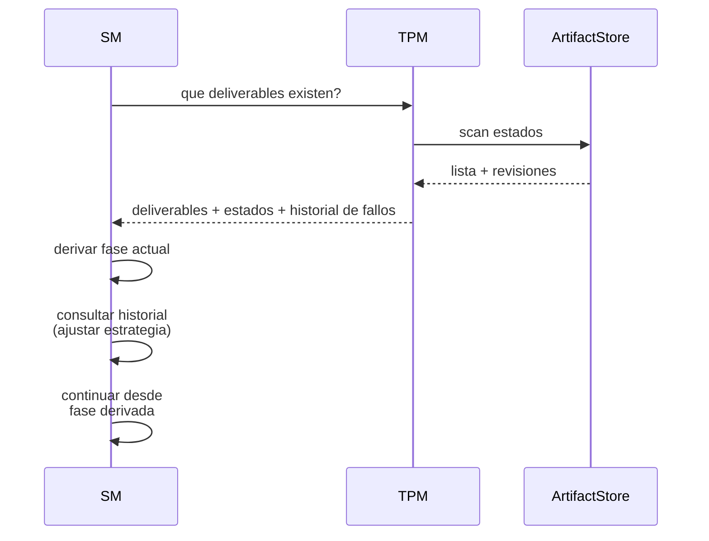

<!-- Virgil Principia
section_id: "10"
title: "Como se recupera"
source: "principia/constitution.md"
source_lines: [1385, 1415]
layer: recovery
constitutional: true
actors: [SM, TPM]
glossary_terms: [Ledger, ArtifactStore]
depends_on: ["5", "8d-8e"]
referenced_by: ["11a-11b"]
keywords:
  - recovery
  - crash
  - compactacion
  - nueva sesion
  - revisiones consolidadas
  - fase derivada
  - historial de fallos
  - lastVerifiedAt
  - cambios externos
editorial_additions: [context_paragraph]
-->

> **Context:** El estado de un proyecto Virgil no se pierde ante un crash, compactacion o nueva sesion — se reconstruye a partir del Ledger y de las revisiones consolidadas de deliverables gestionadas por el TPM (seccion 5).

## 10. Como se recupera

Despues de un crash, compactacion o nueva sesion, el estado se
reconstruye — no se pierde.

- El SM deriva la fase por **revisiones consolidadas** de deliverables, no por mera existencia de archivos. Una revision solo participa en la derivacion de estado cuando su persistencia y su gate/evidencia requerida quedaron confirmados; una revision parcial despues de un crash no hace avanzar la fase.
- El estado de fase no se almacena como puntero autoritativo; se deriva de esas revisiones consolidadas y del Ledger
- El historial de fallos es per-deliverable y cross-session
- `lastVerifiedAt` evita re-verificacion innecesaria si el codigo
  no toco el scope del deliverable
- Cambios externos se clasifican: aditivos (registrar), contradictorios
  (decision del MIM), o de otro ciclo (registrar como contexto)
