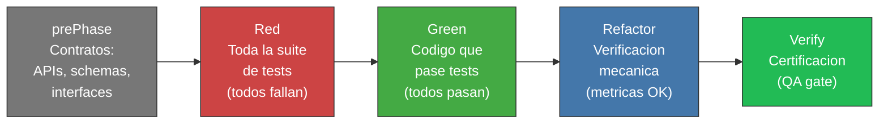
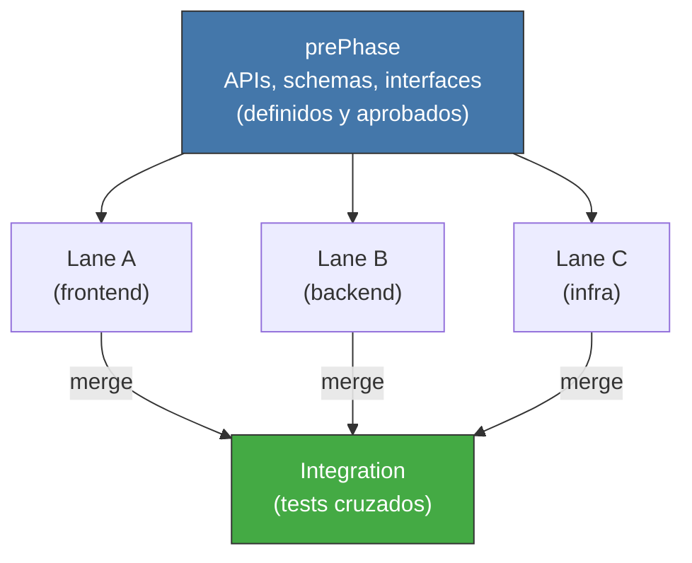

<!-- Virgil Principia
section_id: "11a-11b"
title: "Como se ejecuta — pipeline y contratos primero"
source: "principia/constitution.md"
source_lines: [1418, 1475]
layer: execution
constitutional: true
actors: [SM, Virgil]
glossary_terms: [PlanningGapDetected]
depends_on: ["7a", "7e"]
referenced_by: ["11c", "11d", "11e-routing", "11f"]
keywords:
  - prePhase
  - Red
  - Green
  - Refactor
  - Verify
  - contratos primero
  - paralelismo
  - lanes
  - PlanningGapDetected
  - gate de salida
editorial_additions: [context_paragraph]
-->

> **Context:** Despues de que planning produce un handoff aprobado, la ejecucion transforma ese handoff en una implementacion candidata y Verify la certifica contra los artifacts/evidencia del camino canonico (Echo System, seccion 7a). Virgil observa la ejecucion pero no la dirige.

## 11. Como se ejecuta

Despues de que planning produce un handoff aprobado, la ejecucion
transforma ese handoff en una implementacion candidata y **Verify** la
certifica contra los artifacts/evidencia del camino canonico. Virgil
OBSERVA — no dirige, no implementa. Emite PlanningGapDetected si
detecta vacios.

### 11a. Pipeline de ejecucion

Cinco fases secuenciales. Cada fase tiene su gate de salida.

| Fase | Que produce | Gate de salida |
|------|-------------|----------------|
| prePhase | Contratos fuente (OpenAPI source, schemas, interfaces) | Todos los contratos definidos |
| Red | Suite completa de tests | Todos fallan (red valido) |
| Green | Implementacion | Todos pasan |
| Refactor | Metricas dentro de umbral | Mutation, CRAP, complejidad OK |
| Verify | Certificacion | Gates mecanicas + verificacion estructurada (ver 7e) |

### 11b. Contratos primero — habilitador de paralelismo

La prePhase define contratos ANTES de implementar. Esto permite que
multiples lanes trabajen en paralelo contra la misma interfaz.

