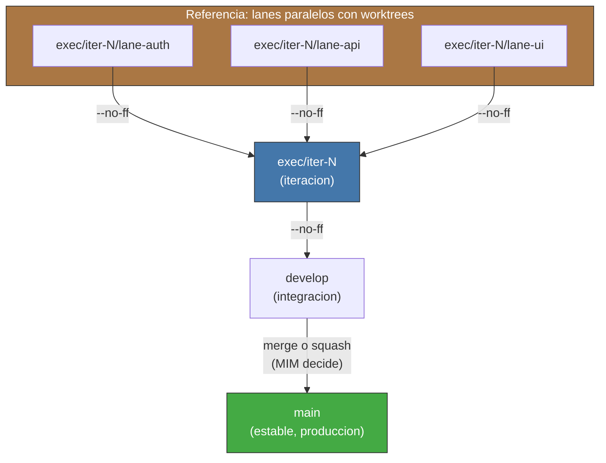

<!-- Virgil Principia
section_id: "11c"
title: "Git strategy — aislamiento y trazabilidad"
source: "principia/overview.md"
source_lines: [1476, 1520]
layer: execution
constitutional: true
actors: [SM, compositeAgent, MIM]
glossary_terms: [mutation domain, buildArtifactSet, sourceRevision, compositeAgent, PlanningGapDetected]
depends_on: ["7c-composite", "8f-construction", "11a-11b"]
referenced_by: ["11d", "11e-routing"]
keywords:
  - mutation domain
  - --no-ff
  - worktrees
  - branches
  - lanes concurrentes
  - buildArtifactSet
  - sourceRevision
  - convenciones de commits
  - invariantes
editorial_additions: [context_paragraph]
-->

> **Context:** Esta seccion detalla la estrategia de control de versiones que sostiene el pipeline de ejecucion (seccion 11a). Se apoya en el concepto de mutation domain (seccion 7c) y en la trazabilidad estructural del codigo (seccion 8f).

### 11c. Git strategy — aislamiento y trazabilidad

El Principia NO impone GitFlow, trunk-based ni nombres de branches concretos. Impone cuatro invariantes:

1. Lanes concurrentes deben tener **mutation domains aislados** mientras divergen (filesystem aislado, deteccion de conflictos al integrar, identidad de revision por lane).
2. Cada `buildArtifactSet` producido por Echo debe estar ligado inequívocamente a la `sourceRevision` que lo genero.
3. La integracion de lanes debe volver a ejecutar el Echo requerido sobre la revision integrada antes de que esa revision pueda certificarse.
4. La identidad y procedencia de cada lane debe **sobrevivir la integracion** y ser mecanicamente verificable en el historial. El enforcement canonico es `--no-ff` (no fast-forward merge); una estrategia alternativa solo es admisible si preserva evidencia equivalente de identidad y procedencia de lane.

La estrategia Git concreta es configurable por proyecto dentro de estos invariantes. El Dogma actual provee worktrees + branches como implementacion de referencia:

Con esa implementacion, cada lane se ejecuta en un worktree aislado y un compositeAgent (seccion 7c) opera dentro de ese mutation domain. Otro proyecto puede usar otro mecanismo de aislamiento siempre que satisfaga las propiedades del mutation domain y los cuatro invariantes de esta seccion.

Si una lane detecta violacion de contrato mid-flight, el SM emite PlanningGapDetected y detiene ESA lane. Las demas lanes en ejecucion que dependen del mismo contrato reciben notificacion de contrato invalidado y entran en estado de pausa pendiente de reconciliacion. Las lanes independientes (sin dependencia del contrato violado) continuan sin interrupcion.

Las convenciones de commits son defaults del Dogma y pueden ser overrideadas por proyecto siempre que Virgil pueda reconstruir fase, revision y evidencia **por parseo determinista** (no por inferencia de un LLM):

| Fase | Prefijo default | Frecuencia default |
|------|-----------------|--------------------|
| prePhase | `contract:` | 1 por tipo |
| Red | `test:` | 1 por test o grupo |
| Green | `feat:` | 1 por test que pasa |
| Refactor | `refactor:` | 1 por refactor atomico |
