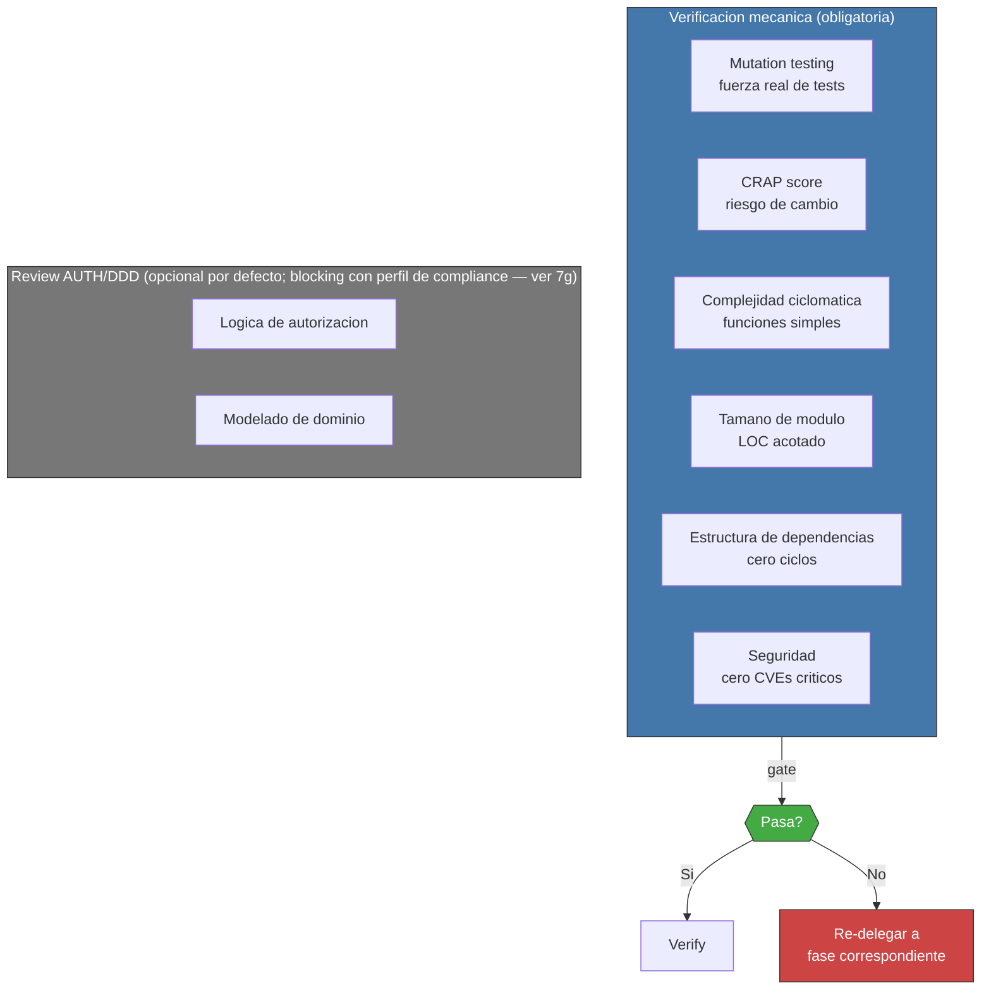

<!-- Virgil Principia
section_id: "11d"
title: "Verificacion mecanica — review humano condicional"
source: "principia/overview.md"
source_lines: [1521, 1556]
layer: execution
constitutional: true
actors: [SM]
glossary_terms: [PDC, CRAP score]
depends_on: ["7e", "7g", "11a"]
referenced_by: ["11e"]
keywords:
  - verificacion mecanica
  - mutation testing
  - CRAP score
  - complejidad ciclomatica
  - tamano de modulo
  - estructura de dependencias
  - seguridad CVEs
  - review AUTH DDD
  - compliance regulatoria
  - Method Pack
  - PDC
-->

> **Context:** Esta seccion describe la fase Refactor del pipeline de ejecucion (seccion 11a). Se apoya en las gates mecanicas y la verificacion estructurada definidas en la seccion 7e, y en el mecanismo de review por perfil de compliance de la seccion 7g.

### 11d. Verificacion mecanica — review humano condicional

La fase Refactor utiliza verificacion mecanica basada en metricas como mecanismo primario de certificacion. Las gates mecanicas (seccion 7e) son el canal principal de calidad. Para proyectos con perfil de compliance regulatoria, el Method Pack activa adicionalmente review humano blocking sobre logica de autorizacion y modelado de dominio (ver seccion 7g). En ambos casos, la certificacion final requiere que TODAS las gates aplicables pasen — tanto las mecanicas como las de review humano cuando estan activas.

Las gates de certificacion combinan verificacion mecanica determinista (test pass/fail, mutation score, coverage, CRAP, CVE scan) y verificacion estructurada (alineacion arquitectonica — ver seccion 7e). El review humano, cuando esta activo por perfil de compliance, tambien forma parte de las gates aplicables. El PDC opera durante la ejecucion como safeguard de coherencia (seccion 3b), pero no forma parte del pipeline de certificacion — puede detener una delegacion incoherente, no certifica ni aprueba codigo.

Los umbrales especificos (mutation score, CRAP maximo, complejidad)
los define el dogma por tier (strict, standard, relaxed). El
Principia define el principio: **mecanico, no subjetivo**.
