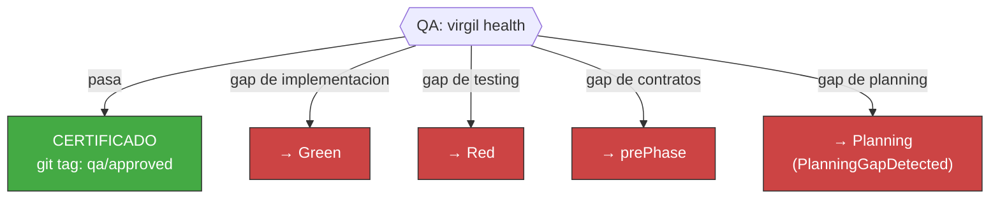

<!-- Virgil Principia
section_id: "11e-routing"
title: "Accept/Reject — certificacion por gates"
source: "principia/overview.md"
source_lines: [1557, 1587]
layer: execution
constitutional: true
actors: [SM]
glossary_terms: [PDC]
depends_on: ["11a-11b", "11d"]
referenced_by: ["11f", "11e-breakglass"]
keywords:
  - QA gate
  - virgil health
  - git tag qa/approved
  - gap de implementacion
  - gap de testing
  - gap de contratos
  - gap de planning
  - PlanningGapDetected
  - re-delegacion
  - PDC
editorial_additions: [context_paragraph]
-->

> **Context:** Esta seccion cierra el pipeline de ejecucion (seccion 11a) describiendo como la fase Verify certifica o rechaza una revision, y a que fase especifica se re-delega cuando se detecta un gap.

### 11e. Accept/Reject — certificacion por gates

| Tipo de gap | Rechazo | Re-delegar a |
|-------------|---------|--------------|
| Codigo no satisface test | Implementacion incompleta | Green |
| Suite de tests incompleta | Tests faltantes | Red |
| Contrato violado | Interfaz rota | prePhase |
| Diseno no reflejado en codigo | Arquitectura divergente | Refactor |
| Feature faltante en planning | Deliverable insuficiente | Planning |

El rechazo es ESPECIFICO — identifica la fase exacta que debe
corregirse, no un generico "arreglar". Cada re-delegacion pasa por
el PDC completo (seccion 9c).
