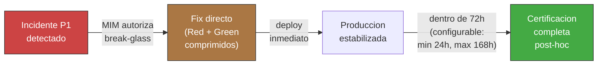

<!-- Virgil Principia
section_id: "11e-breakglass"
title: "Lane de emergencia (break-glass)"
source: "principia/overview.md"
source_lines: [1588, 1617]
layer: execution
constitutional: false
actors: [MIM]
glossary_terms: [Break-glass, Ledger]
depends_on: ["11e-routing"]
referenced_by: []
keywords:
  - break-glass
  - incidente P1
  - autorizacion MIM
  - standing policy
  - certificacion post-hoc
  - 72 horas
  - Ledger
  - deuda tecnica critica
editorial_additions: [context_paragraph]
-->

> **Context:** El break-glass es un camino excepcional dentro de la fase de ejecucion (seccion 11e), reservado para incidentes P1 en produccion. No reemplaza la ceremonia de certificacion — la comprime y la difiere, nunca la elimina.

#### Lane de emergencia (break-glass)

Para incidentes P1 en produccion, existe un camino expedito que
comprime la ceremonia sin eliminarla:

| Restriccion | Regla |
|-------------|-------|
| Autorizacion | Solo el MIM puede activar break-glass. En equipos con MIM no siempre disponible, una standing policy emitida por el MIM puede pre-autorizar activaciones bajo condiciones mecanicamente verificables: tipos de incidente cubiertos, fecha de expiracion de la policy, y notificacion obligatoria al MIM dentro de un plazo definido |
| Scope | Exclusivamente el fix del incidente — cero features |
| Certificacion | Certificacion completa post-hoc dentro de 72 horas (configurable por el Method Pack, minimo 24h, maximo 168h) |
| Registro | El Ledger registra la activacion como evento auditable |

Una standing policy no transfiere autoridad ni amplia scope: declara condiciones cerradas bajo las cuales break-glass puede activarse sin presencia del MIM. Cada activacion debe demostrar que cumplio las condiciones pre-autorizadas, quedar atribuida a la politica MIM vigente, y notificar al MIM dentro del plazo declarado en la policy.

El break-glass NO es un atajo — es un camino documentado con
restricciones explicitas. Un fix sin certificacion post-hoc dentro
de las 72 horas (o el plazo configurado) se trata como deuda tecnica critica.
