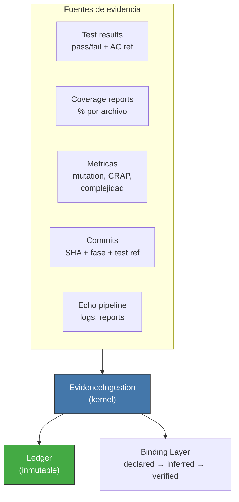

<!-- Virgil Principia
section_id: "11f"
title: "Evidencia como dato queryable"
source: "principia/constitution.md"
source_lines: [1618, 1649]
layer: execution
constitutional: true
actors: []
glossary_terms: [EchoRun, buildArtifactSet, Ledger, Binding Layer]
depends_on: ["7b", "8c-watermark", "11a-11b"]
referenced_by: ["12"]
keywords:
  - evidencia queryable
  - EvidenceIngestion
  - Ledger inmutable
  - Binding Layer
  - declared inferred verified
  - EchoRun
  - buildArtifactSet
  - test results
  - coverage
  - mutation testing
editorial_additions: [context_paragraph]
-->

> **Context:** Esta seccion cierra el pipeline de ejecucion (seccion 11a) explicando como toda la evidencia generada se ingiere de forma estructurada, ligada al EchoRun canonico (seccion 7b), y como alimenta la progresion del Binding Layer.

### 11f. Evidencia como dato queryable

Todo lo que ocurre durante ejecucion se ingiere como evidencia
queryable, no como documentacion narrativa. Para **certificacion de
codigo**, los resultados de tests, coverage, metricas, scanners y builds
solo son elegibles cuando estan ligados a un `EchoRun` y su
`buildArtifactSet`. Evidencia de planning, decisiones humanas o eventos
de operacion puede provenir de otras fuentes, pero no sustituye el camino
Echo para certificar codigo.

La evidencia alimenta el Binding Layer: cada commit con referencia
a un test mueve el enlace de `declared` a `inferred`. La verificacion
mecanica (mutation testing) lo mueve a `verified`.
