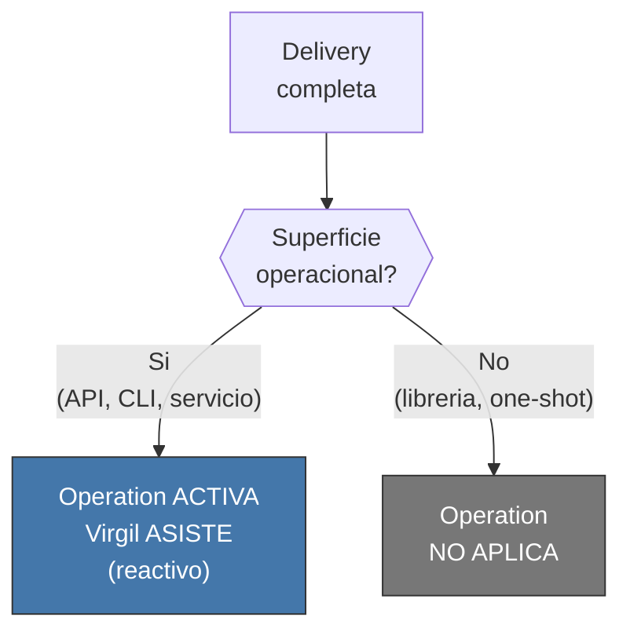
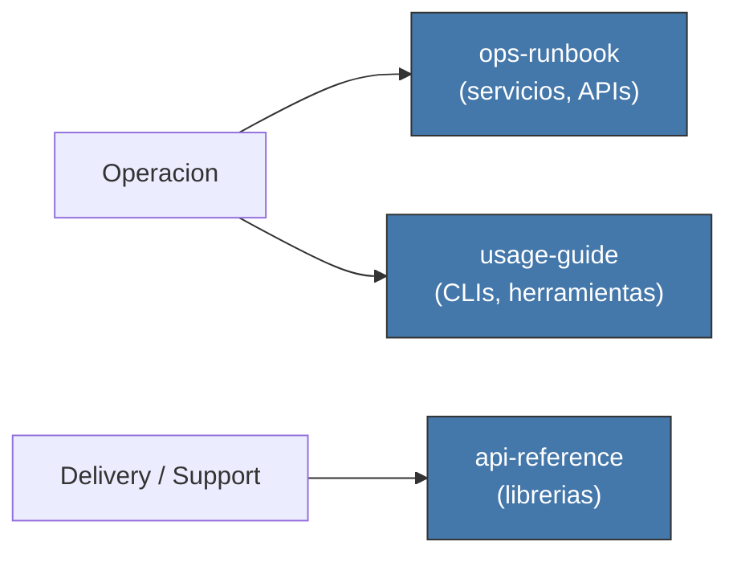
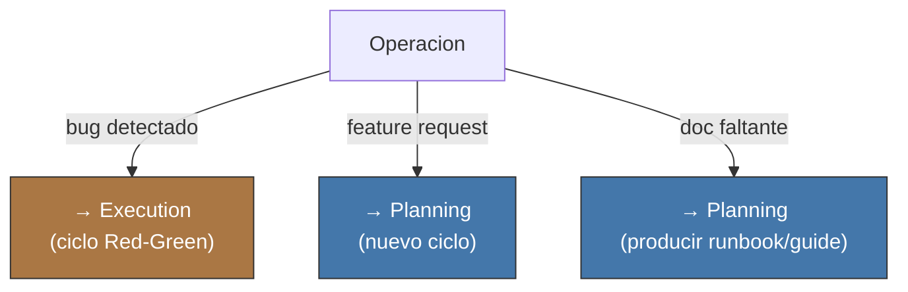

<!-- Virgil Principia
section_id: "12"
title: "Como opera (opcional)"
source: "principia/constitution.md"
source_lines: [1652, 1717]
layer: operation
constitutional: false
actors: [MIM, Agente, Virgil]
glossary_terms: []
depends_on: ["11f"]
referenced_by: []
keywords:
  - operacion
  - superficie operacional
  - operationalAssistant
  - ops-runbook
  - usage-guide
  - api-reference
  - Delivery support
  - escalacion
  - bug detectado
  - feature request
  - doc faltante
editorial_additions: [context_paragraph]
-->

> **Context:** La fase de Operation es opcional y se activa unicamente cuando el producto entregado tiene superficie operacional activa. No aplica a librerias ni a deliverables de un solo uso, cuya documentacion pertenece a Delivery/support.

## 12. Como opera (opcional)

La fase de operacion se activa SOLO si el producto tiene superficie
operacional activa (APIs, CLIs, servicios o herramientas operadas).
Una libreria por si sola no activa Operation; su API reference pertenece
a Delivery/support documentation. Tampoco aplica a deliverables de un
solo uso.

### 12a. Activacion y rol

| Actor | Rol en operacion |
|-------|-----------------|
| MIM | Usuario — consume el producto |
| Agente | operationalAssistant — ejecuta solicitudes del MIM dentro del contexto del producto |
| Virgil | Asiste al agente con contexto, NO dirige |

### 12b. Adapters de operacion

Dos tipos de documentacion pertenecen directamente a Operation; las librerias mantienen `api-reference` como artifact de Delivery/support, sin activar por si mismas la fase operacional.

### 12c. Escalacion

Si operacion detecta problemas, escala de vuelta al ciclo
correspondiente.

Operacion nunca corrige bugs inline ni agrega features sin pasar
por el ciclo completo. El principio de metodologia e2e (gobierno
principio 1) aplica igual en post-entrega.
