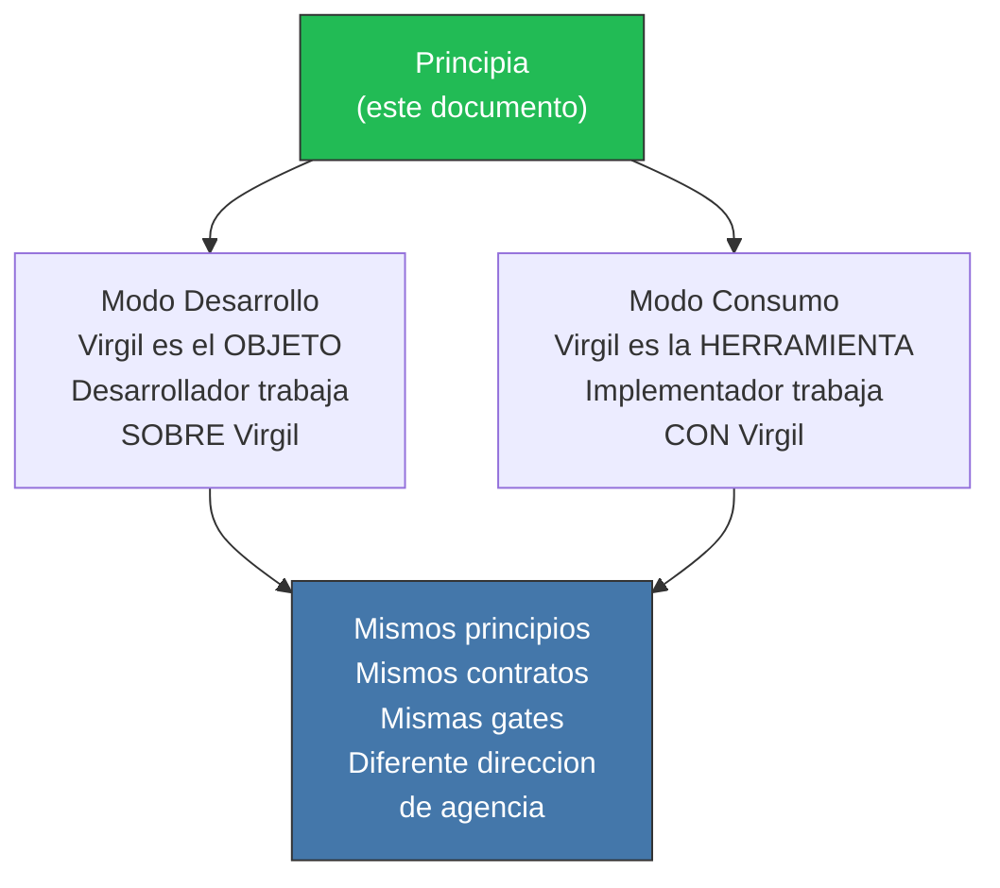

<!-- Virgil Principia
section_id: "authority"
title: "Autoridad y auto-referencia"
source: "principia/overview.md"
source_lines: [1720, 1788]
layer: authority
constitutional: true
actors: []
glossary_terms: []
depends_on: []
referenced_by: []
keywords:
  - regla de auto-referencia
  - Modo Desarrollo
  - Modo Consumo
  - mismos principios
  - mismos contratos
  - mismas gates
  - direccion de agencia
  - inmutable
  - fuente de verdad
  - nota de autoridad
-->

> **Context:** Esta regla establece que el Principia tiene la misma autoridad constitucional sobre ambos modos de uso descritos en el documento: Modo Desarrollo (donde Virgil es el objeto de trabajo) y Modo Consumo (donde Virgil es la herramienta que asiste otro trabajo).

## Regla de auto-referencia

Este Principia gobierna AMBOS modos con la misma autoridad:

---

## Nota de autoridad

Este documento es inmutable una vez consolidado.

**Fuente de verdad**: `principia/overview.md`

Este Principia gobierna con igual fuerza el **Modo Desarrollo** (donde Virgil es el objeto sobre el cual se trabaja) y el **Modo Consumo** (donde Virgil es la herramienta con la cual se trabaja). Ambos modos heredan los mismos principios de gobierno, arquitectura, contratos y gates.
